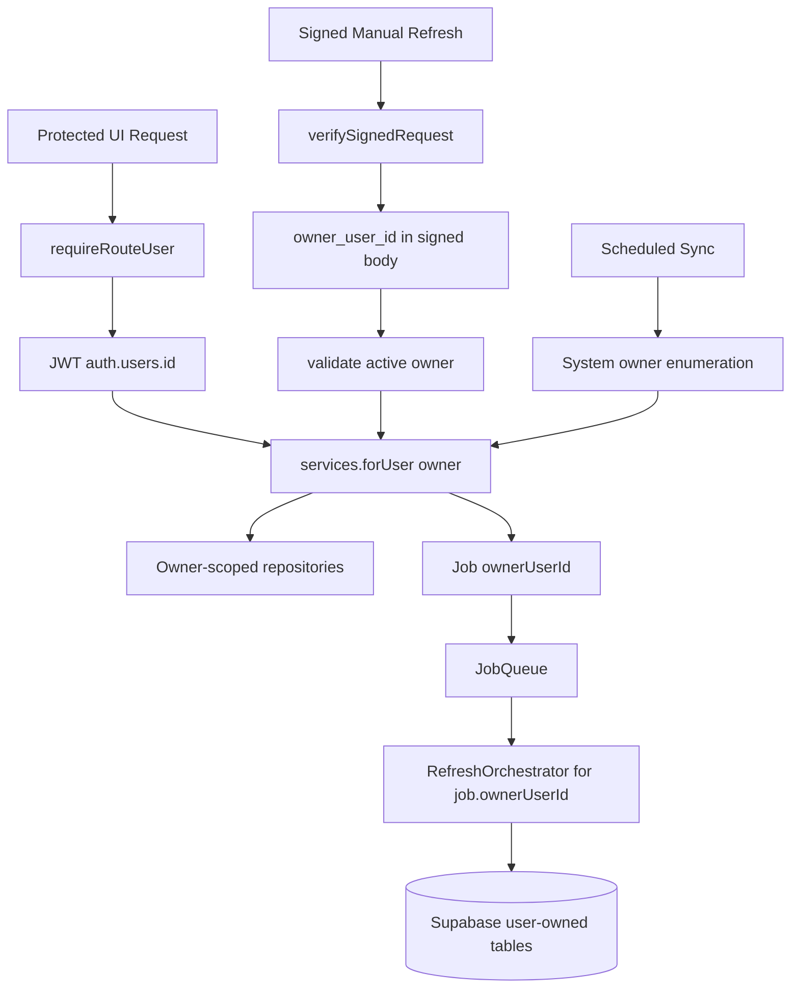

# Architecture

## Intent

Keep the modular monolith, but make user-owned storage request scoped instead of app-start scoped.

## Target Boundary

```text
JWT request
  -> requireRouteUser()
  -> services.forUser(user.id)
  -> owner-scoped Supabase repositories

HMAC manual refresh
  -> verify signature
  -> validate signed owner_user_id
  -> services.forUser(owner_user_id)
  -> enqueue job with ownerUserId

System scheduled sync
  -> system owner enumeration helper
  -> services.forUser(account.ownerUserId)
  -> enqueue job with ownerUserId

JobQueue
  -> job.ownerUserId
  -> services.forUser(job.ownerUserId)
  -> RefreshOrchestrator writes owner-scoped rows
```

## Runtime Interfaces

```ts
interface UserScopedServices {
  accountRepository: AccountConfigRepository;
  jobRepository: JobRepository;
  rawRecordRepository: RawRecordRepository;
  normalizedRecordRepository: NormalizedRecordRepository;
  sheetSnapshotRepository: SheetSnapshotRepository;
  statusService: StatusService;
  uiDashboardService: UiDashboardService;
  manualRefreshService: ManualRefreshService;
}

interface UserScopedServiceFactory {
  forUser(userId: string): UserScopedServices;
}
```

System helpers are separate and named explicitly:

```ts
interface SystemOwnershipRepository {
  listActiveAccountsWithOwners(): Promise<AccountConfig[]>;
  listJobsByStatusesAcrossOwners(statuses: JobStatus[]): Promise<Job[]>;
}
```

## Coupling Rules

- Route handlers must pass the resolved owner to `services.forUser(ownerId)` before reading user-owned data.
- `Job` includes `ownerUserId`; queue workers must not infer ownership from account id.
- User-owned repositories may still use the service-role Supabase client, but every query must include explicit owner scope.
- System helpers may query across owners only for scheduler/recovery enumeration and must return rows with `ownerUserId`.
- Tests must model at least two owners; single-owner tests are insufficient for this feature.

## Diagram


