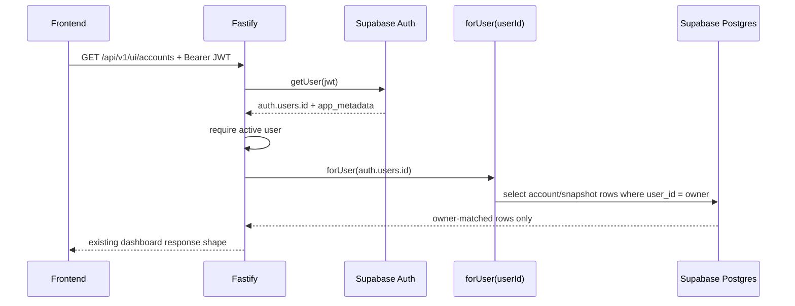
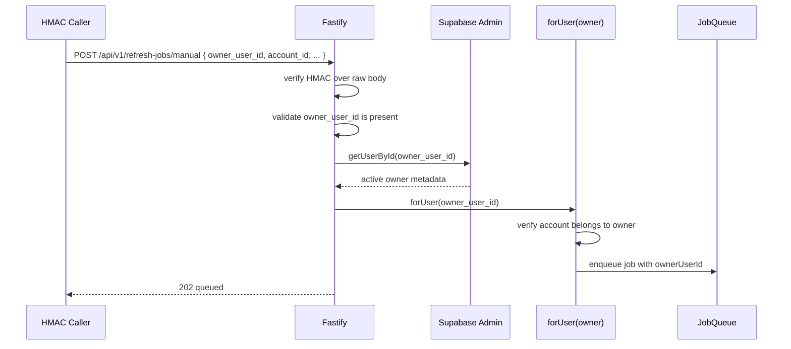
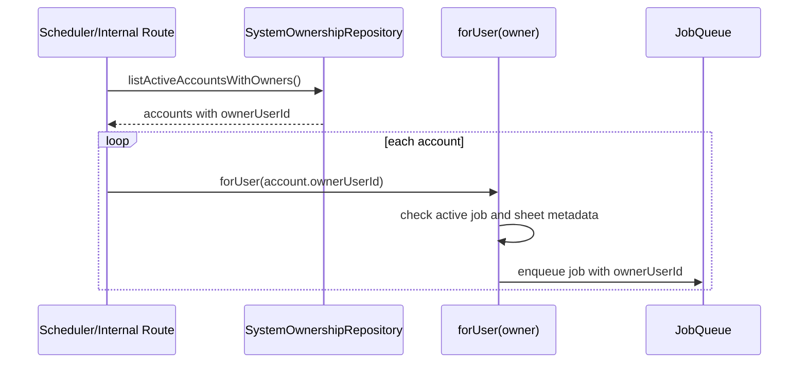
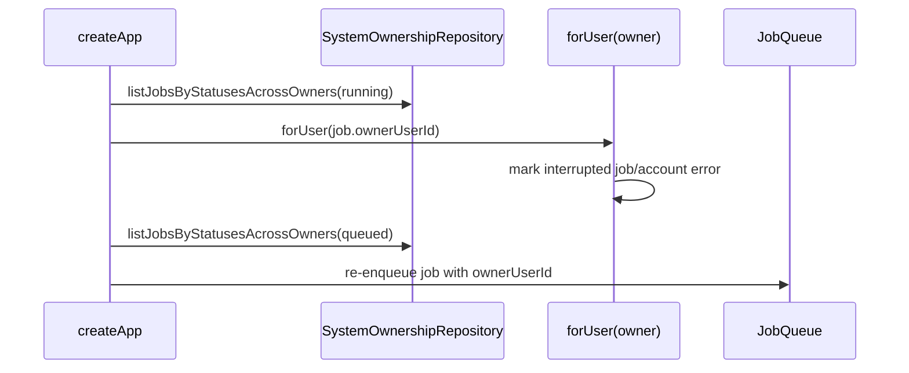

# Runtime Flows

## UI Dashboard

## Manual Refresh

Rejected cases:

- Missing `owner_user_id`: `400 VALIDATION_ERROR`.
- Unknown owner: `404 USER_NOT_FOUND`.
- Pending/rejected owner: `403 USER_PENDING` or `403 USER_REJECTED`.
- Account not owned by owner: existing account-not-configured error.

## Scheduled Sync

## Restart Recovery

