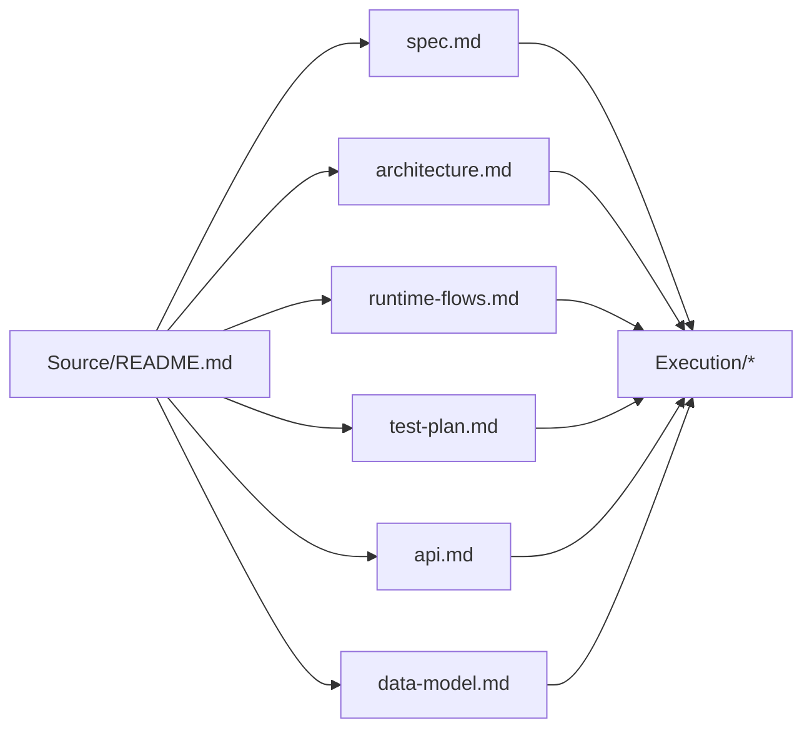

# fix-request-scoped-supabase-ownership

## Summary

Remove the remaining fixed startup owner path from Supabase runtime storage. User-owned data must be scoped by active JWT user, signed internal owner, or explicit system enumeration.

## Implementation Readiness

- Status: `ready_for_implementation`
- Baseline snapshots: `Execution/baseline-*.md`
- Current slice source: first non-`committed` row in `Execution/slice-tracker.md`
- This branch stacks on PR #14 until `fix/migration-auth-filestore-retirement` merges.

## Document Flow

