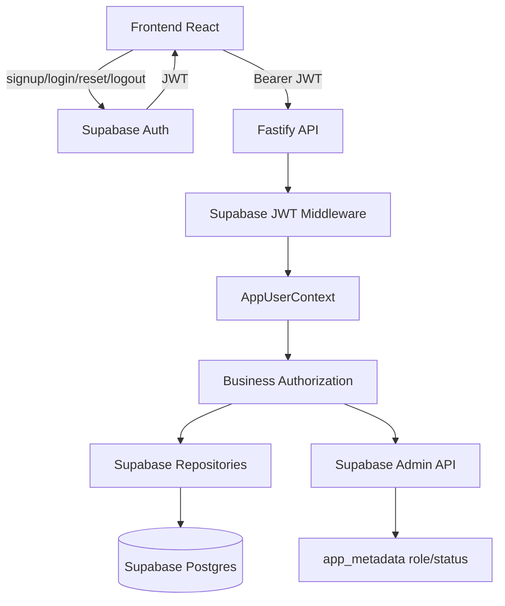

# Baseline Architecture Snapshot

Snapshot of `architecture.md` for Main handoff on 2026-05-01.

## Target Architecture

## Key Boundaries

- Frontend uses Supabase Auth directly.
- Backend registration sync must not receive passwords.
- Backend validates JWT and derives `AppUserContext`.
- `app_metadata.role/status` is server-managed authorization state.
- Runtime repositories are Supabase-backed only.
- Tests use explicit mocks/stubs, not FileStore fallback.
