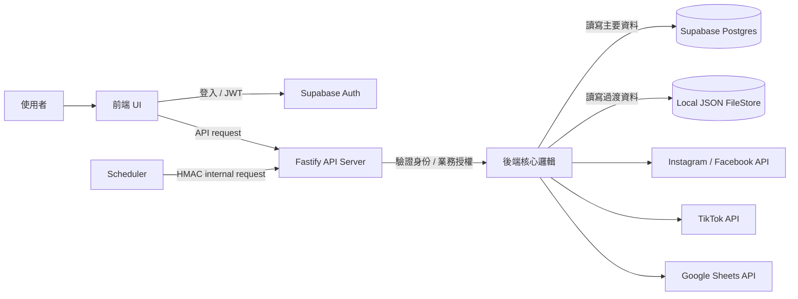
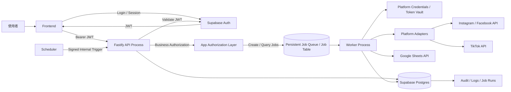
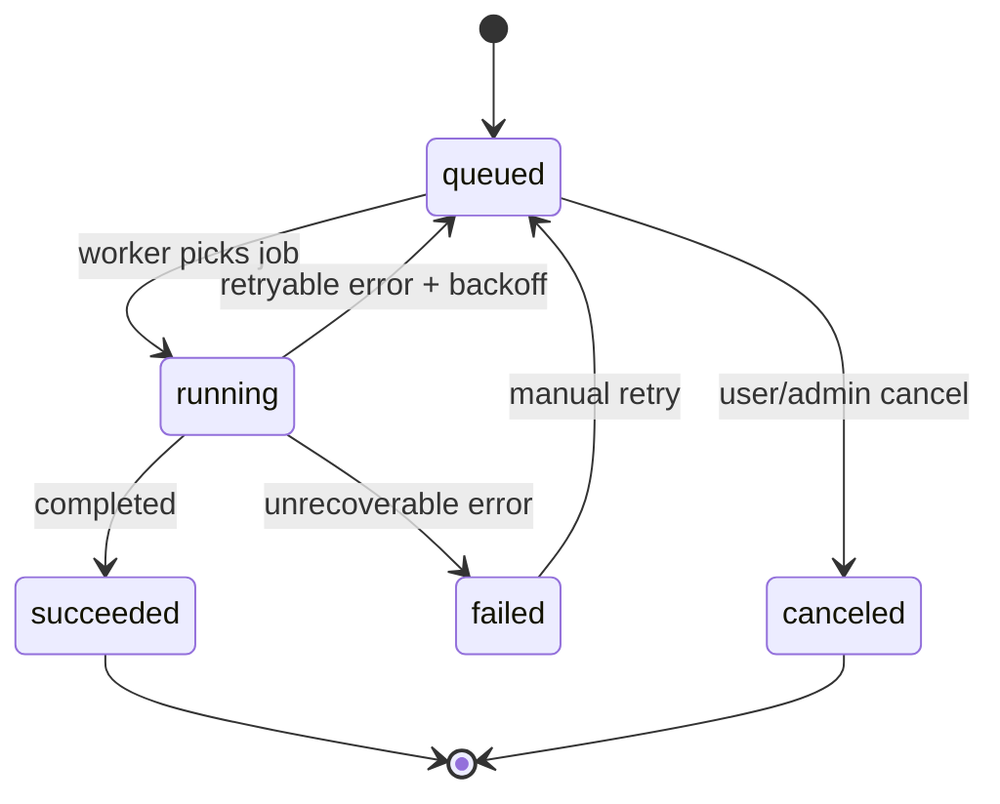
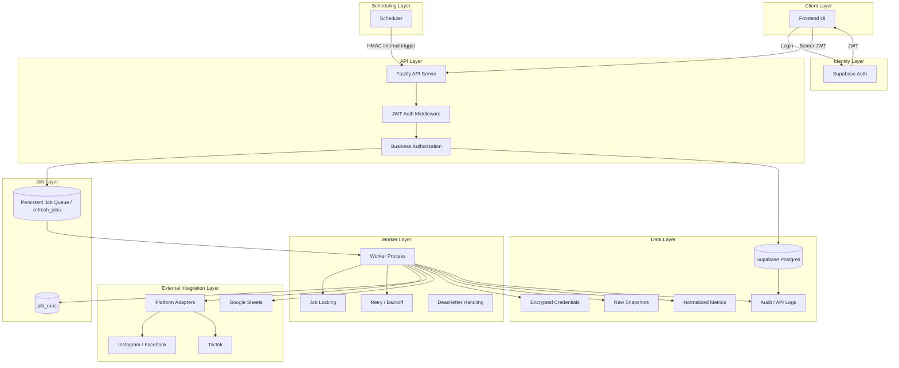

# Tsukiyo_Data 宏觀架構評估與調整建議

> 文件用途：將目前系統職責圖整理成可落地的架構檢視文件，供開發、重構、部署與技術決策使用。  
> 文件版本：v0.1  
> 日期：2026-04-30  
> 適用範圍：前端、Fastify 後端、Supabase Auth/Postgres、社群平台資料抓取、Google Sheets 匯出、排程與任務處理。

---

## 1. 總體結論

目前的宏觀方向是合理的：

- 前端保持薄層，只負責 UI、登入狀態與 API 呼叫。
- 後端集中處理業務決策、授權、任務建立、資料抓取與外部服務整合。
- Supabase Auth 負責身份驗證，不直接承擔完整業務授權。
- 社群平台 token 與 Google Sheets OAuth token 不下放前端。
- 手動刷新與排程刷新應共用同一條後端 pipeline。

但目前架構仍有三個核心風險需要優先處理：

1. **身份系統雙軌**：舊 cookie session 與 Supabase JWT 並存。
2. **資料儲存雙軌**：Supabase Postgres 與本地 JSON FileStore 並存。
3. **任務處理尚未正式化**：queue、retry、idempotency、dead-letter、rate limit 與 job lifecycle 需要被明確建模。

本文件建議採用 **modular monolith + API/worker runtime 分離** 的方式推進，不建議在目前階段直接拆成多個微服務。

---

## 2. 現況推定架構



### 2.1 已具備的合理設計

| 面向 | 評估 |
|---|---|
| 前端邊界 | 前端不持有社群平台 token，方向正確。 |
| 後端角色 | 後端集中做授權、排程、抓取、正規化與寫入，方向正確。 |
| Auth 分工 | Supabase Auth 作為身份來源，業務授權留在 app/backend 層，方向正確。 |
| 排程設計 | Scheduler 透過 internal endpoint 觸發，且應與手動刷新共用 pipeline，方向正確。 |
| 外部平台整合 | Instagram/Facebook/TikTok/Google Sheets 都應由後端 adapter 管理，方向正確。 |

### 2.2 目前主要架構債

| 風險 | 說明 | 影響 |
|---|---|---|
| 本地 JSON FileStore | 存放使用者帳號、session、reset token、outbox 等資料。 | 難以水平擴充、難以備份、容易與 Supabase 資料不同步。 |
| cookie session + JWT 並存 | 身份來源與失效邏輯不一致。 | API 授權邏輯複雜化，長期維護成本增加。 |
| 後端核心過大 | API、worker、抓取、匯出、授權與排程混在同一責任區。 | 錯誤隔離困難，部署與擴充困難。 |
| 任務系統不完整 | queue、retry、rate limit、dead-letter 未被明確獨立。 | 任務重跑、失敗追蹤、外部 API 限流會變困難。 |
| service-role / RLS 語意容易混淆 | 後端若使用 service-role 或 secret key，通常會繞過 RLS。 | 若誤以為 RLS 會保護後端 admin query，可能造成越權資料暴露。 |

---

## 3. 建議目標架構

建議目標不是立即拆微服務，而是將目前系統整理成：

```text
Modular Monolith Codebase
+ API Process
+ Worker Process
+ Persistent Job Queue / Job Table
+ Supabase Postgres as Primary Storage
```

### 3.1 目標架構圖



### 3.2 核心原則

| 原則 | 實作方向 |
|---|---|
| 單一身份來源 | `auth.users.id` 作為全系統 canonical `user_id`。 |
| 前端不直接操作敏感資料 | 前端不持有社群平台 access token、refresh token、Google Sheets credential。 |
| 後端負責業務授權 | 後端每次操作前都要建立 user context 並檢查權限。 |
| 任務持久化 | 所有 refresh/export 任務必須有可查詢、可重試、可恢復的 job record。 |
| API 與 worker 分離 | API process 處理 request/response；worker process 處理 background jobs。 |
| 外部平台 adapter 化 | Instagram/Facebook/TikTok/Google Sheets 的 API 差異封裝在 adapter 層。 |
| 可觀測性優先 | 每次任務、外部 API 呼叫、資料匯出、錯誤都需要可追蹤。 |

---

## 4. 身份與授權設計

### 4.1 建議身份模型

```text
Supabase Auth
  auth.users.id = canonical user_id

Application Database
  profiles.user_id -> auth.users.id
  platform_accounts.user_id -> auth.users.id
  refresh_jobs.user_id -> auth.users.id
  sheet_exports.user_id -> auth.users.id
  audit_events.user_id -> auth.users.id
```

### 4.2 Supabase Auth 的責任

Supabase Auth 建議只負責：

- 使用者註冊與登入。
- 發行 access token / refresh token。
- 維護 `auth.users`。
- 提供 JWT 給前端與後端驗證。

Supabase Auth 不建議直接承擔完整業務決策，例如：

- 使用者是否可抓取某個社群帳號。
- 使用者是否可執行某個排程。
- 使用者是否可匯出 Google Sheets。
- 使用者目前方案是否允許某個功能。

這些應放在後端 app authorization layer 或資料庫 policy 中。

### 4.3 app_metadata 與 user_metadata

建議：

```text
app_metadata:
  - role
  - status
  - plan
  - organization_id

user_metadata:
  - display_name
  - avatar_url
  - locale
  - user preference
```

注意事項：

- `user_metadata` 可由使用者更新，不適合放授權資料。
- `app_metadata` 較適合放 role/status/plan 等授權相關資訊。
- JWT 不是即時同步資料源，metadata 變更後通常要等 token refresh 才會反映。
- 高風險授權判斷不應只依賴前端目前持有的舊 JWT claim。

### 4.4 cookie session 退場策略

目前若同時存在舊 cookie session 與 Supabase JWT，建議採三階段退場：

| 階段 | 策略 |
|---|---|
| Phase 1 | 後端同時接受舊 cookie session 與 Supabase JWT，僅作過渡。 |
| Phase 2 | 所有新 API 只接受 Supabase JWT。舊 API 加上 deprecated 標記。 |
| Phase 3 | 移除舊 cookie session，或只保留為內部 admin 特殊用途。 |

API middleware 建議統一輸出：

```ts
interface AppUserContext {
  userId: string;
  authProvider: 'supabase';
  role: string;
  status: string;
  plan?: string;
  organizationId?: string;
}
```

---

## 5. Supabase Postgres 與 RLS 邊界

### 5.1 正確安全模型

需要區分兩種資料存取路徑：

```text
前端 → Supabase
  - 使用 publishable / anon key
  - 依賴 RLS 控制資料存取
  - 適合低風險、user-scoped 的資料讀寫

前端 → Fastify → Supabase
  - Fastify 可使用 service-role / secret key
  - 後端必須自行完成 authentication + authorization
  - 不應假設 RLS 會保護 service-role 查詢
```

### 5.2 service-role / secret key 注意事項

若後端使用 service-role 或 secret key：

- key 必須只存在 server-side 環境變數。
- 不得暴露在瀏覽器、前端 bundle 或 client log 中。
- 後端 query 必須主動加上 user scope，例如 `where user_id = currentUser.id`。
- 高風險操作需寫入 audit log。
- repository 層應避免出現未限定 scope 的查詢。

建議 repository pattern：

```ts
class PlatformAccountRepository {
  async listByUser(userId: string) {
    return db
      .from('platform_accounts')
      .select('*')
      .eq('user_id', userId);
  }

  async getByIdForUser(accountId: string, userId: string) {
    return db
      .from('platform_accounts')
      .select('*')
      .eq('id', accountId)
      .eq('user_id', userId)
      .single();
  }
}
```

不建議：

```ts
// 危險：service-role 查詢若未加 user scope，可能取到非當前使用者資料。
db.from('platform_accounts').select('*').eq('id', accountId).single();
```

---

## 6. 本地 JSON FileStore 遷移建議

### 6.1 應遷移的資料

| 目前資料 | 建議去向 | 優先級 |
|---|---|---|
| 使用者帳號 | Supabase Auth + `profiles` table | P0 |
| 登入 session | Supabase Auth session / JWT | P0 |
| 密碼重設 token | Supabase Auth password reset flow，或 Postgres token table | P0 |
| 通知 outbox | `notification_outbox` table | P0 |
| 任務暫存資料 | `refresh_jobs` / `job_runs` table | P1 |
| 抓取快照 | `raw_snapshots` table 或 object storage | P1 |

### 6.2 FileStore 的剩餘定位

本地 JSON FileStore 最多只應保留為：

- local development fallback
- mock data
- test fixture
- migration staging file

不建議作為 production path。

### 6.3 遷移完成標準

FileStore 可視為退場完成的條件：

- 新使用者不再寫入 FileStore。
- 新 session 不再寫入 FileStore。
- 密碼重設不再依賴 FileStore。
- notification outbox 不再依賴 FileStore。
- 所有 production deployment 即使多 instance，也不依賴 local disk 資料一致性。

---

## 7. 任務系統設計

### 7.1 為什麼需要正式任務表

社群平台資料抓取不是一般同步 API 呼叫，因為它具有以下特性：

- 可能執行時間較長。
- 容易遇到外部 API failure。
- 容易遇到 rate limit。
- 需要 retry/backoff。
- 需要避免重複抓取與重複寫入。
- 需要向使用者解釋「為什麼今天沒有更新」。

因此，刷新與匯出都應建模為持久化 job。

### 7.2 refresh_jobs table 建議

```sql
create table refresh_jobs (
  id uuid primary key default gen_random_uuid(),
  user_id uuid not null,
  platform text not null,
  target_account_id uuid not null,
  status text not null check (
    status in ('queued', 'running', 'succeeded', 'failed', 'canceled')
  ),
  trigger_source text not null check (
    trigger_source in ('manual', 'scheduler', 'webhook', 'retry')
  ),
  idempotency_key text not null,
  scheduled_at timestamptz not null default now(),
  started_at timestamptz,
  finished_at timestamptz,
  retry_count integer not null default 0,
  max_retries integer not null default 3,
  last_error text,
  locked_by text,
  locked_until timestamptz,
  created_at timestamptz not null default now(),
  updated_at timestamptz not null default now()
);

create unique index refresh_jobs_idempotency_key_idx
  on refresh_jobs (idempotency_key);

create index refresh_jobs_status_scheduled_at_idx
  on refresh_jobs (status, scheduled_at);
```

### 7.3 job_runs table 建議

```sql
create table job_runs (
  id uuid primary key default gen_random_uuid(),
  job_id uuid not null references refresh_jobs(id),
  attempt_no integer not null,
  status text not null check (
    status in ('running', 'succeeded', 'failed')
  ),
  started_at timestamptz not null default now(),
  finished_at timestamptz,
  result_summary jsonb,
  error_payload jsonb,
  api_quota_snapshot jsonb,
  created_at timestamptz not null default now()
);
```

### 7.4 任務狀態機



### 7.5 idempotency key 建議

建議 idempotency key 由以下欄位組合：

```text
platform + target_account_id + metric_type + time_window + trigger_source_normalized
```

範例：

```text
instagram:account_123:profile_metrics:2026-04-30:daily_refresh
```

目的：

- 避免 scheduler 重複建立同一任務。
- 避免使用者連點造成重複刷新。
- 避免 worker crash 後重跑造成重複寫入。

---

## 8. API Process 與 Worker Process 分離

### 8.1 API Process 責任

API process 負責：

- 驗證 Supabase JWT。
- 建立 `AppUserContext`。
- 做業務授權。
- 建立 refresh/export job。
- 回傳 job 狀態。
- 提供使用者查詢資料與任務結果。

API process 不應直接長時間抓取社群平台資料。

### 8.2 Worker Process 責任

Worker process 負責：

- 從 job queue / job table 取任務。
- 處理 lock 與 concurrency。
- 呼叫外部平台 adapter。
- refresh platform token。
- 正規化 raw data。
- 寫入 Supabase Postgres。
- 推送 Google Sheets。
- 處理 retry、backoff 與 dead-letter。

### 8.3 建議部署模型

```text
same codebase
  ├─ npm run start:api
  └─ npm run start:worker
```

或：

```text
Docker image: tsukiyo-data-app
  API container:
    command: node dist/api.js

  Worker container:
    command: node dist/worker.js
```

這樣可以保持同一套程式碼與型別模型，但讓 runtime responsibility 分離。

---

## 9. 後端模組切分建議

不建議立即拆微服務。建議先整理成 modular monolith。

```text
src/
  modules/
    auth/
      auth.middleware.ts
      supabase-jwt.service.ts
      app-user-context.ts

    users/
      profile.repository.ts
      user.service.ts

    authorization/
      policy.service.ts
      plan-limit.service.ts
      role.service.ts

    platform-accounts/
      platform-account.repository.ts
      platform-account.service.ts
      credential.service.ts

    refresh-jobs/
      refresh-job.repository.ts
      refresh-job.service.ts
      job-state-machine.ts
      idempotency.ts

    workers/
      worker-runner.ts
      job-locker.ts
      retry-policy.ts

    platforms/
      instagram.adapter.ts
      facebook.adapter.ts
      tiktok.adapter.ts
      platform-adapter.interface.ts

    normalization/
      raw-to-normalized.mapper.ts
      metric-schema.ts

    sheets/
      google-sheets.adapter.ts
      sheet-export.service.ts
      sheet-export.repository.ts

    notifications/
      notification-outbox.repository.ts
      notification-dispatcher.ts

    observability/
      audit-log.repository.ts
      api-call-log.repository.ts
      logger.ts
```

---

## 10. Secret 與 Token Storage

### 10.1 建議獨立標示的資料類型

社群平台 token 與 Google Sheets token 不是普通資料，建議在架構中獨立標示：

```text
Platform Credentials / Token Vault
  - encrypted access_token
  - encrypted refresh_token
  - token_expired_at
  - provider
  - account_id
  - revoked_at
  - last_refreshed_at
```

### 10.2 platform_credentials table 建議

```sql
create table platform_credentials (
  id uuid primary key default gen_random_uuid(),
  user_id uuid not null,
  platform_account_id uuid not null,
  provider text not null,
  encrypted_access_token text,
  encrypted_refresh_token text,
  token_expires_at timestamptz,
  scopes text[],
  revoked_at timestamptz,
  last_refreshed_at timestamptz,
  created_at timestamptz not null default now(),
  updated_at timestamptz not null default now()
);

create index platform_credentials_user_id_idx
  on platform_credentials (user_id);

create index platform_credentials_platform_account_id_idx
  on platform_credentials (platform_account_id);
```

### 10.3 Token 操作原則

- token 必須加密儲存。
- access token 快取需有到期時間。
- refresh token rotation 要有紀錄。
- revoke 後不得再被 worker 使用。
- token 失效時，job 應進入可解釋狀態，例如 `failed:credential_revoked`。
- 不應將完整 token 寫入 log。

---

## 11. 外部平台 Adapter 設計

### 11.1 統一介面

```ts
interface PlatformAdapter {
  provider: 'instagram' | 'facebook' | 'tiktok';

  refreshToken(input: RefreshTokenInput): Promise<RefreshTokenResult>;

  fetchProfileMetrics(input: FetchMetricsInput): Promise<RawMetricsResult>;

  fetchPostMetrics(input: FetchPostMetricsInput): Promise<RawPostMetricsResult>;

  normalize(raw: unknown): Promise<NormalizedMetrics>;
}
```

### 11.2 好處

- 隔離各平台 API 差異。
- 統一錯誤格式。
- 統一 retry 與 rate limit 策略。
- 讓 worker 不需要知道平台細節。
- 後續新增 YouTube、Threads、X 等平台時比較容易。

### 11.3 錯誤分類

```ts
type PlatformErrorType =
  | 'rate_limited'
  | 'credential_expired'
  | 'credential_revoked'
  | 'permission_denied'
  | 'platform_unavailable'
  | 'invalid_response'
  | 'unknown';
```

這些錯誤類型應映射到 job retry policy。

---

## 12. Google Sheets 匯出設計

### 12.1 建議流程

```text
Worker completes normalized data
  ↓
Create sheet_export job/run
  ↓
Load Google credential
  ↓
Write to Google Sheets
  ↓
Record export snapshot
  ↓
Update job status
```

### 12.2 sheet_exports table 建議

```sql
create table sheet_exports (
  id uuid primary key default gen_random_uuid(),
  user_id uuid not null,
  job_id uuid references refresh_jobs(id),
  spreadsheet_id text not null,
  sheet_name text not null,
  exported_range text,
  export_status text not null check (
    export_status in ('queued', 'running', 'succeeded', 'failed')
  ),
  rows_written integer,
  snapshot_hash text,
  error_payload jsonb,
  created_at timestamptz not null default now(),
  finished_at timestamptz
);
```

### 12.3 匯出注意事項

- 不應只知道「已推送」，應知道推送到哪一個 spreadsheet、哪個 sheet、哪個 range。
- 應保存 snapshot hash，避免重複匯出相同資料。
- Google Sheets API failure 應有 retry/backoff。
- 使用者撤銷 Google OAuth 後，任務應顯示明確錯誤。

---

## 13. Observability 與稽核

### 13.1 建議補上的紀錄表

| 表 | 用途 |
|---|---|
| `audit_events` | 記錄使用者/系統的高風險操作。 |
| `api_call_logs` | 記錄外部平台 API 呼叫、狀態碼、錯誤類型、rate limit。 |
| `job_runs` | 記錄每次任務嘗試與結果。 |
| `platform_rate_limit_snapshots` | 記錄平台限流狀態。 |
| `sheet_export_logs` | 記錄 Google Sheets 匯出細節。 |
| `notification_outbox` | 記錄待寄通知、已寄通知與寄送失敗。 |

### 13.2 audit_events table 建議

```sql
create table audit_events (
  id uuid primary key default gen_random_uuid(),
  user_id uuid,
  actor_type text not null check (
    actor_type in ('user', 'system', 'scheduler', 'worker', 'admin')
  ),
  event_type text not null,
  entity_type text,
  entity_id uuid,
  metadata jsonb,
  ip_address text,
  user_agent text,
  created_at timestamptz not null default now()
);

create index audit_events_user_id_created_at_idx
  on audit_events (user_id, created_at desc);
```

### 13.3 需要回答的營運問題

架構應能回答：

- 今天某個帳號為什麼沒有更新？
- 是 scheduler 沒觸發，還是 job 失敗？
- 是平台 token 過期，還是 API rate limit？
- Google Sheets 是否成功寫入？
- 寫入了哪個 spreadsheet / sheet / range？
- 同一個 job 是否重跑過？
- 是否發生過重複寫入？

---

## 14. 優先級 Roadmap

### P0：身份與儲存收斂

| 項目 | 目標 | 完成標準 |
|---|---|---|
| 定義 canonical user id | 使用 `auth.users.id` 作為唯一 user id。 | 所有 app table 都以 Supabase user id 關聯。 |
| 移除 FileStore user/session | 不再用 JSON 保存使用者與 session。 | production path 不依賴 local user/session JSON。 |
| 密碼重設遷移 | 使用 Supabase Auth reset flow 或 Postgres token table。 | FileStore 不再保存 reset token。 |
| outbox 遷移 | notification outbox 進 Postgres。 | 多 instance 可安全處理通知。 |

### P1：任務與 worker 正式化

| 項目 | 目標 | 完成標準 |
|---|---|---|
| 建立 refresh_jobs | 所有抓取任務可追蹤。 | 任務具備 status、retry、idempotency。 |
| 建立 job_runs | 每次嘗試可追蹤。 | 可查每次失敗原因與結果摘要。 |
| API/worker 分離 | 長任務不阻塞 API。 | 可以獨立啟動 API 與 worker process。 |
| retry/backoff | 外部 API failure 可恢復。 | retryable error 自動重試，unrecoverable error 明確失敗。 |
| dead-letter | 長期失敗任務可隔離。 | 超過 max retry 後進入 failed/dead-letter 狀態。 |

### P1：安全語意修正

| 項目 | 目標 | 完成標準 |
|---|---|---|
| service-role 使用規範 | 後端使用 admin key 時自行授權。 | repository query 均有 user scope 或 admin audit。 |
| RLS 邊界文件化 | 明確分辨 frontend RLS 與 backend service-role。 | 架構文件、程式碼註解與測試一致。 |
| token storage | 平台 token 加密保存。 | token 不出現在前端、不出現在 log。 |

### P2：可觀測性與營運強化

| 項目 | 目標 | 完成標準 |
|---|---|---|
| audit_events | 高風險操作可稽核。 | 可追 user/admin/system 操作。 |
| api_call_logs | 外部 API 問題可診斷。 | 可查平台錯誤、狀態碼、限流情況。 |
| sheet_export_logs | 匯出問題可診斷。 | 可查 spreadsheet、sheet、range、rows_written。 |
| dashboard | 給營運/開發查任務狀態。 | 可視化 queued/running/failed jobs。 |

---

## 15. 建議調整後的文件版架構圖



---

## 16. 實作檢查清單

### 16.1 Auth / Authorization

- [ ] 所有 API 都透過同一個 JWT middleware 建立 `AppUserContext`。
- [ ] 舊 cookie session API 標記 deprecated。
- [ ] 所有業務操作都通過 authorization service。
- [ ] role/status/plan 不從前端請求 body 信任取得。
- [ ] admin 操作全部寫入 audit log。

### 16.2 Database

- [ ] `profiles.user_id` 對應 Supabase `auth.users.id`。
- [ ] 本地 JSON FileStore 不作為 production canonical source。
- [ ] 所有 user-owned table 均有 `user_id`。
- [ ] repository query 均有 user scope。
- [ ] service-role query 經過安全檢查。

### 16.3 Jobs / Workers

- [ ] 所有 refresh/export 都建立 job record。
- [ ] job 有 status lifecycle。
- [ ] job 有 idempotency key。
- [ ] worker 有 lock 與 timeout。
- [ ] retryable error 與 unrecoverable error 被區分。
- [ ] 超過重試次數的 job 有明確 failed/dead-letter 狀態。

### 16.4 External APIs

- [ ] 平台 API 經過 adapter 封裝。
- [ ] token refresh 被集中處理。
- [ ] token 不寫入 log。
- [ ] rate limit 有紀錄。
- [ ] Google Sheets 匯出有 snapshot / range / rows_written 紀錄。

### 16.5 Observability

- [ ] 任務失敗可查原因。
- [ ] 外部 API failure 可查平台、狀態碼、錯誤類型。
- [ ] 使用者問題可由 job id 或 account id 追蹤。
- [ ] scheduler 執行紀錄可查。
- [ ] worker crash 後任務可恢復。

---

## 17. 建議決策摘要

| 決策 | 建議 |
|---|---|
| 是否拆微服務 | 暫時不要。先做 modular monolith。 |
| 是否保留 FileStore | production 不建議保留。只作 local dev/mock。 |
| 是否使用 Supabase Auth | 建議使用，並以 `auth.users.id` 作 canonical user id。 |
| 是否依賴 RLS | 前端直連 Supabase 時依賴 RLS；後端 service-role 操作需自行授權。 |
| 任務系統用什麼 | 短期可用 Postgres job table；量大後再評估 Redis/BullMQ、pg-boss、Temporal。 |
| API 與 worker 是否拆開 | 建議拆成不同 process，但維持同一 codebase。 |
| token 是否可放前端 | 不可。社群平台與 Google Sheets token 應只在後端處理。 |

---

## 18. 外部參考

> 以下連結用於確認 Supabase key、RLS、JWT metadata 與 Auth 行為。實作前仍建議以最新官方文件為準。

- Supabase — Understanding API keys: https://supabase.com/docs/guides/api/api-keys
- Supabase — Securing your data: https://supabase.com/docs/guides/database/secure-data
- Supabase — Row Level Security: https://supabase.com/docs/guides/database/postgres/row-level-security
- Supabase — JWT Claims Reference: https://supabase.com/docs/guides/auth/jwt-fields
- Supabase — Users: https://supabase.com/docs/guides/auth/users
- Supabase — Managing user data: https://supabase.com/docs/guides/auth/managing-user-data

---

## 19. 下一步建議

建議下一步不是再畫更大的架構圖，而是先落地三件事：

1. 建立 `refresh_jobs` / `job_runs` / `notification_outbox` schema。
2. 將 API 與 worker 在 runtime 上分離。
3. 制定 FileStore 退場計畫，並定義 Supabase `auth.users.id` 為唯一 canonical user id。

完成後，系統會從「可跑的整合型後端」提升到「可部署、可追蹤、可擴充的資料任務平台」。
