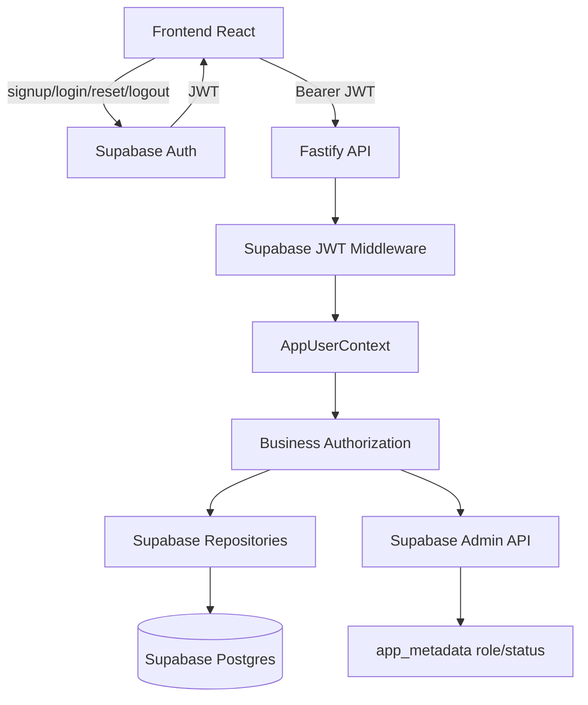

# Architecture

## Intent

Converge identity and runtime persistence onto Supabase while keeping the codebase a modular monolith.

The target shape is:

```text
Frontend
  -> Supabase Auth for signup/login/reset/logout
  -> Fastify API with Bearer JWT

Fastify API
  -> validates Supabase JWT
  -> derives AppUserContext from auth.users + app_metadata
  -> writes app data through Supabase repositories

Supabase
  -> Auth owns identity/session/password reset
  -> Postgres owns app profiles, approvals, jobs, records, snapshots
```

## Boundaries

- Frontend may use Supabase client for Auth only.
- Frontend must not send passwords to Fastify after Supabase signup.
- Fastify is responsible for business authorization and service-role scoping.
- Supabase `app_metadata` owns `role` and `status`; `user_metadata` is display/preference data only.
- Repository interfaces may be adjusted, but the runtime repository implementation must be Supabase-backed.
- Test doubles must be explicit mocks/stubs; they must not reintroduce FileStore as fallback.

## Interfaces

### App User Context

All protected backend routes should operate on one context shape:

```ts
interface AppUserContext {
  userId: string;
  email: string;
  displayName: string;
  role: "admin" | "member";
  status: "pending" | "active" | "rejected";
  authProvider: "supabase";
}
```

### Metadata Contract

```ts
interface SupabaseAppMetadata {
  role?: "admin" | "member";
  status?: "pending" | "active" | "rejected";
}
```

- Missing `role` defaults to `member`.
- Missing `status` defaults to `pending`.
- High-risk authorization must enforce `status === "active"` server-side.

### Registration Sync Boundary

- Input comes from JWT-authenticated Supabase user plus optional display name.
- Backend reads `req.user.id` / Supabase user id from JWT validation.
- Backend must not accept `external_user_id`, `email`, `role`, `status`, or `password` as trusted request authority.

## Diagram



## Coupling Rules

- `backend/src/app.ts` composes concrete Supabase dependencies only; no storage feature flag branch remains.
- Auth route handlers must not import legacy password/session services.
- Approval service may call Supabase Admin API and profile/audit repositories, but must not write `user_metadata` authorization claims.
- Frontend auth hooks may import Supabase auth helpers, but must not call legacy password/session HTTP helpers.
