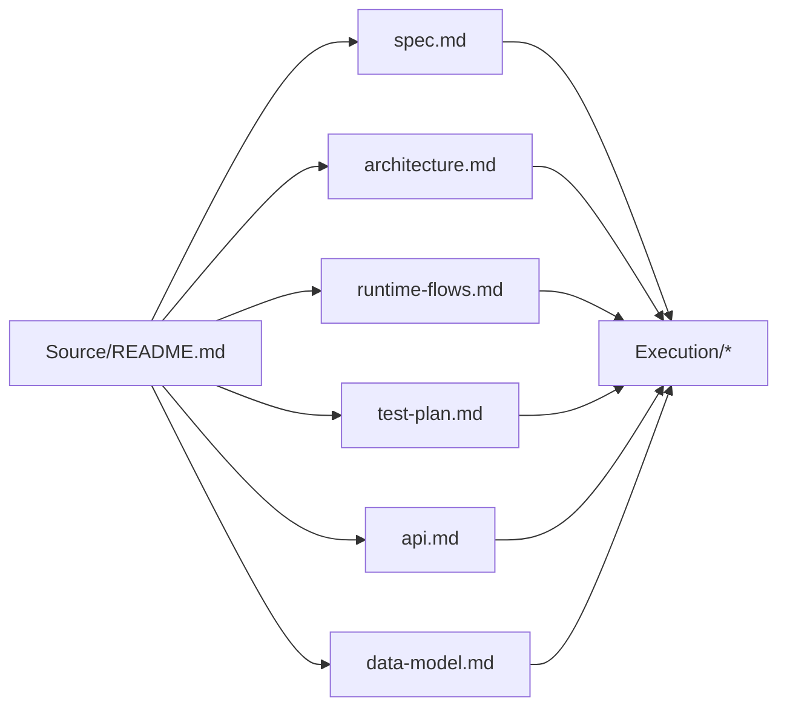

# migration-auth-filestore-retirement

## Summary

Retire the remaining auth and runtime FileStore paths so production runtime uses Supabase Auth plus Supabase-backed storage only.

This pack constrains P0 work only:

- Supabase Auth is the single identity source.
- `auth.users.id` is the canonical user id.
- `app_metadata.role/status` is the authorization source.
- Backend registration sync must not receive user passwords.
- FileStore is removed from runtime storage paths, including local/dev fallback.

## Implementation Readiness

- Status: `ready_for_implementation`
- Baseline snapshots: `Execution/baseline-*.md`
- Current slice source: first non-`committed` row in `Execution/slice-tracker.md`
- Execution reports: `Execution/implementation-log.md`, `Execution/test-log.md`, `Execution/commit-log.md`

## Document Flow

## Notes

- `Source/tsukiyo_macro_architecture_review.md` is an input review, not binding spec.
- P1 job/worker formalization is deliberately excluded from this pack.
- Main must not preserve FileStore as local/test fallback; tests should use mocks/stubs or Supabase-backed fixtures.
