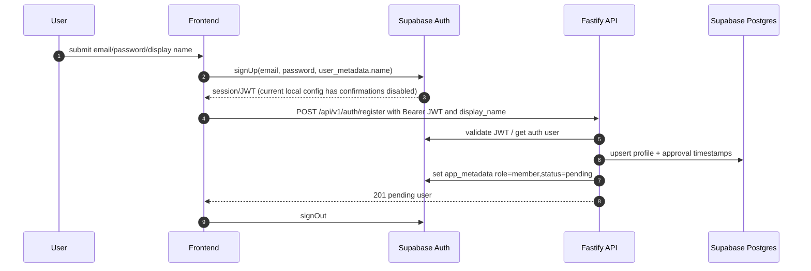
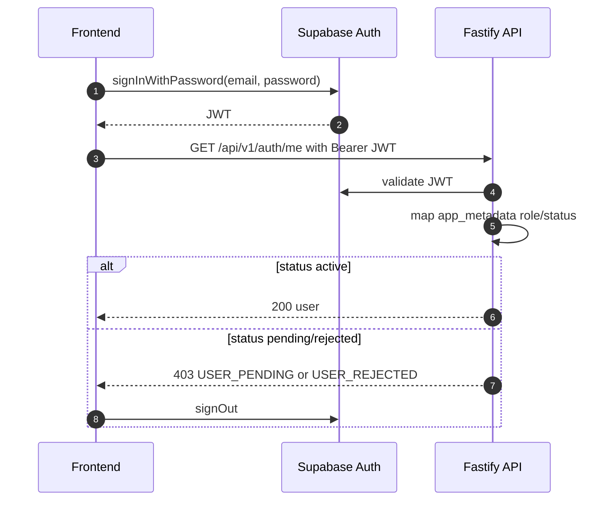
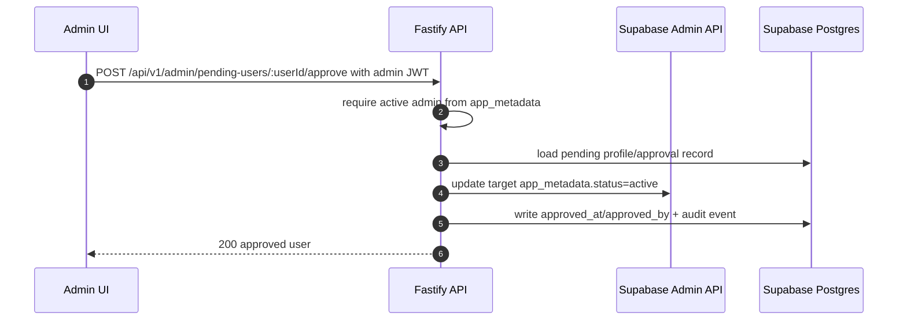
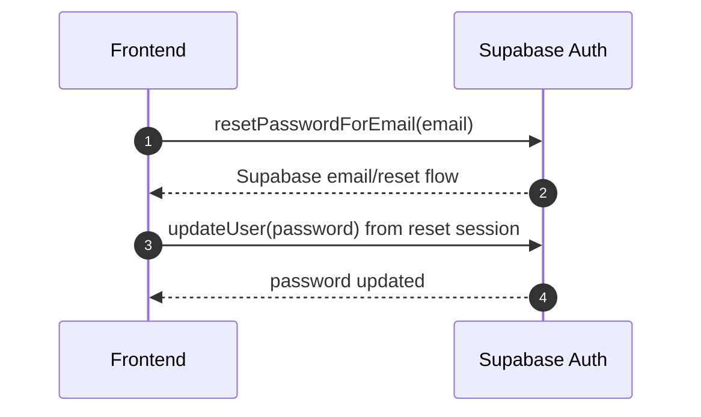
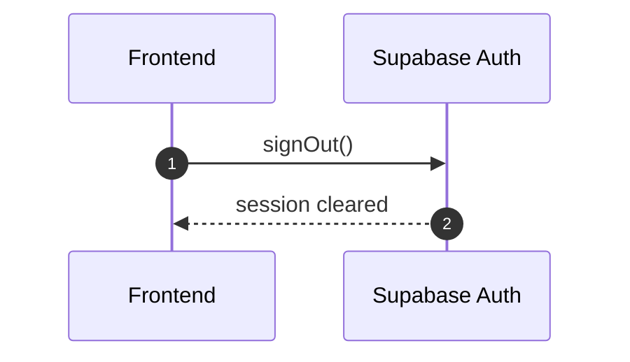

# Runtime Flows

## Signup And Pending Sync

## Login And Current User

## Admin Approval

## Password Reset

## Logout

## Error Flow

- Missing Bearer JWT returns `401 MISSING_JWT`.
- Invalid or expired JWT returns `401 INVALID_JWT`.
- `pending` users return `403 USER_PENDING`.
- `rejected` users return `403 USER_REJECTED`.
- Legacy login/forgot/reset compatibility stubs return `410 LEGACY_AUTH_REMOVED` and must not touch storage.
- Logout compatibility route returns 200 no-op and must not touch storage.
