# Social Data Hub — 架構報告

> 分支: `001-social-data-hub` | 報告日期: 2026-03-18

---

## 1. 專案概述

**Social Data Hub** 是一個社群行銷資料中台服務，用於從 Instagram、Facebook、TikTok 等平台自動抓取內容資料，經過正規化處理後同步至 Google Sheet（目前以本地 JSON 檔案模擬）。

### 技術棧

| 項目 | 選擇 |
|------|------|
| Runtime | Node.js >= 24 |
| 模組系統 | ESM (ECMAScript Modules) |
| 外部依賴 | **零** — 完全使用 Node 標準函式庫 |
| 持久化 | JSON 檔案（原子寫入） |
| 認證 | HMAC-SHA256 簽章驗證 + Cookie-based Session |
| 測試框架 | `node:test` (內建) |
| 平台資料來源 | Fixture JSON 檔案（模擬 API） |

---

## 2. 系統全域架構

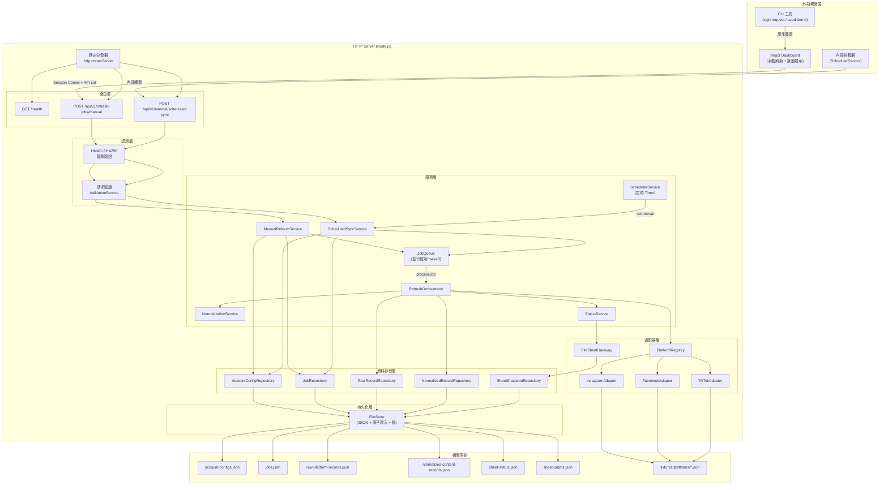

---

## 3. 分層架構

```mermaid
graph LR
    subgraph L1["第一層: 入口"]
        S["server.js"]
        A["app.js<br/>(組合根)"]
    end

    subgraph L2["第二層: 路由"]
        R1["health-route"]
        R2["manual-refresh-route"]
        R3["scheduled-sync-route"]
    end

    subgraph L3["第三層: 服務"]
        S1["AuthService"]
        S2["ValidationService"]
        S3["ManualRefreshService"]
        S4["ScheduledSyncService"]
        S5["SchedulerService"]
        S6["JobQueue"]
        S7["RefreshOrchestrator"]
        S8["NormalizationService"]
        S9["StatusService"]
        S10["JobFactory"]
    end

    subgraph L4["第四層: 適配器"]
        A1["PlatformRegistry"]
        A2["FixturePlatformAdapter"]
        A3["FileSheetGateway"]
    end

    subgraph L5["第五層: 資料存取"]
        D1["AccountConfigRepo"]
        D2["JobRepo"]
        D3["RawRecordRepo"]
        D4["NormalizedRecordRepo"]
        D5["SheetSnapshotRepo"]
    end

    subgraph L6["第六層: 基礎設施"]
        I1["FileStore"]
        I2["Logger"]
        I3["HTTP Utils"]
        I4["Error Types"]
    end

    L1 --> L2 --> L3 --> L4 --> L5 --> L6
```

---

## 4. 資料流 — 手動刷新 (Manual Refresh)

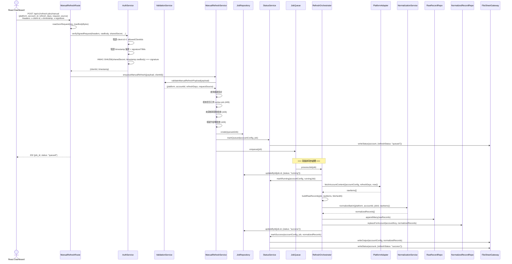

---

## 5. 資料流 — 排程同步 (Scheduled Sync)

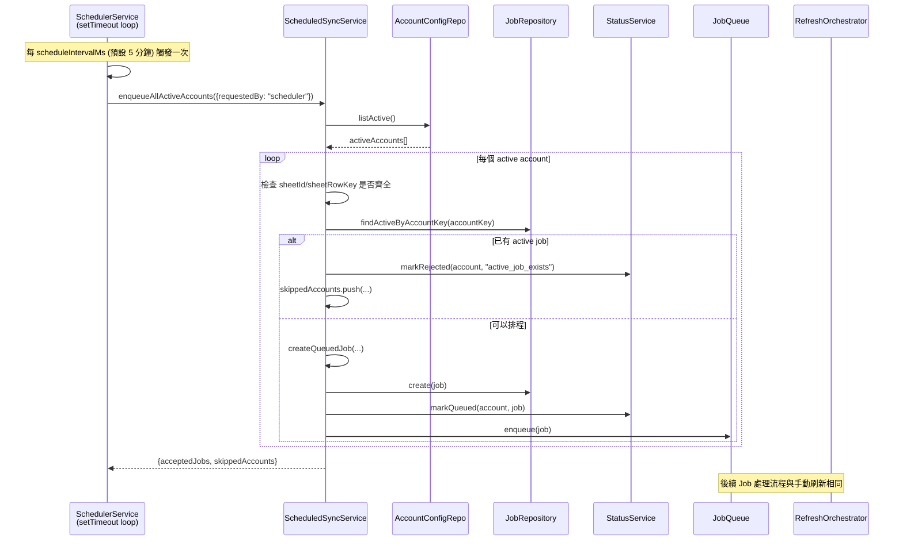

---

## 6. 也可由 API 觸發排程同步

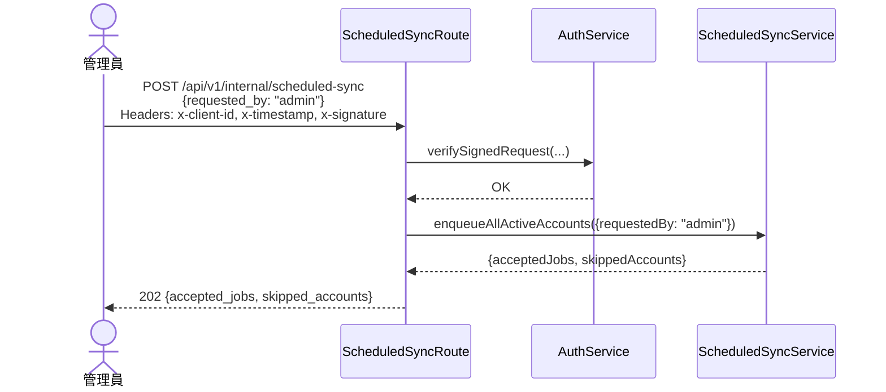

---

## 7. Job 狀態機

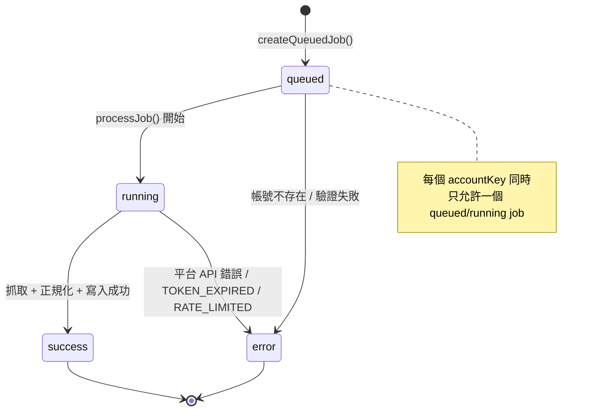

---

## 8. 資料模型 (Entity Relationship)

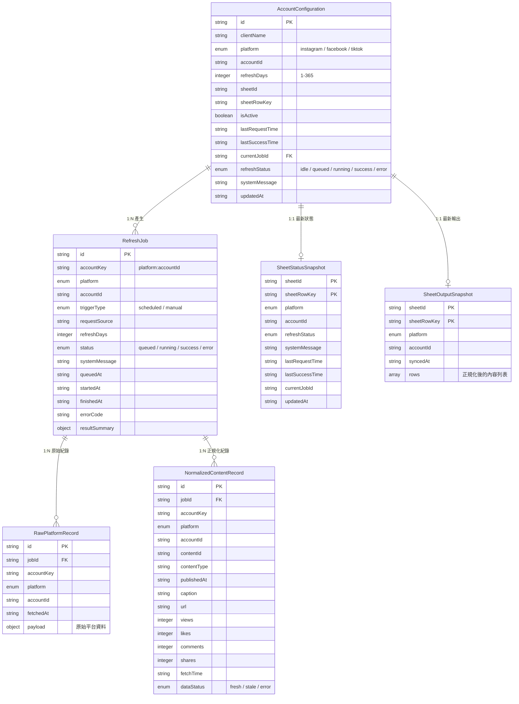

---

## 9. JobQueue 並行控制模型

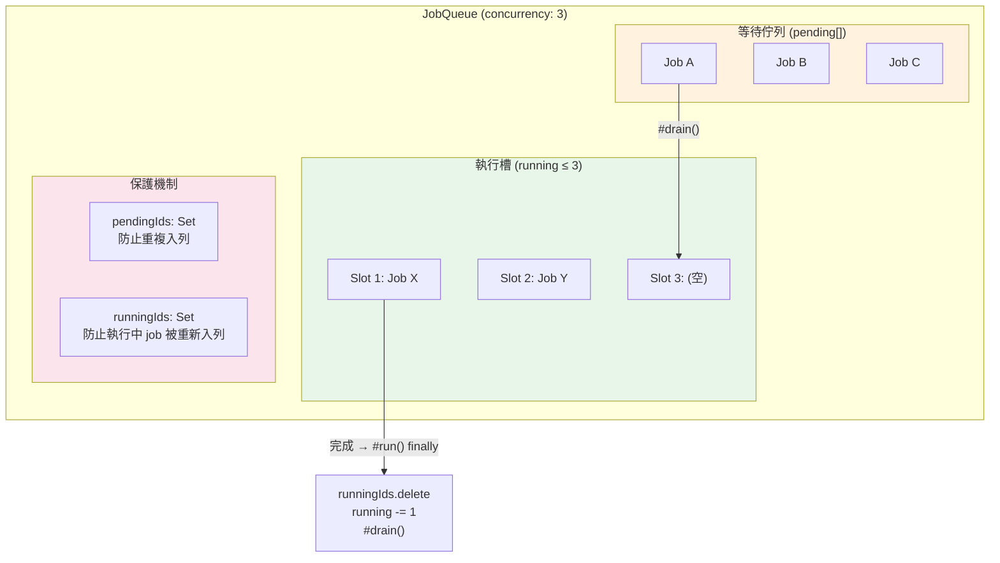

---

## 10. FileStore 持久化機制

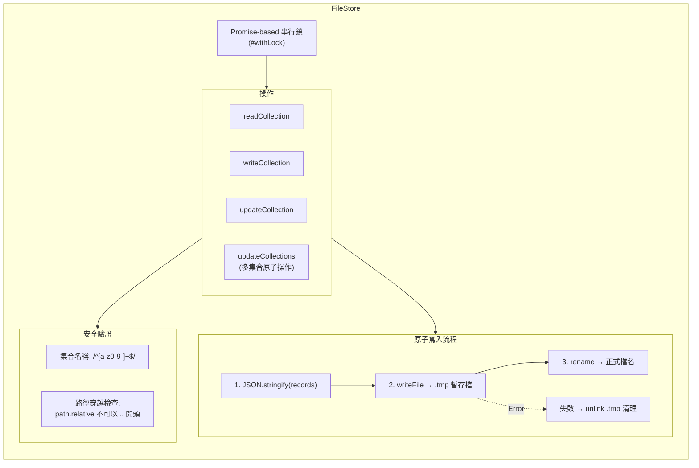

---

## 11. 認證流程

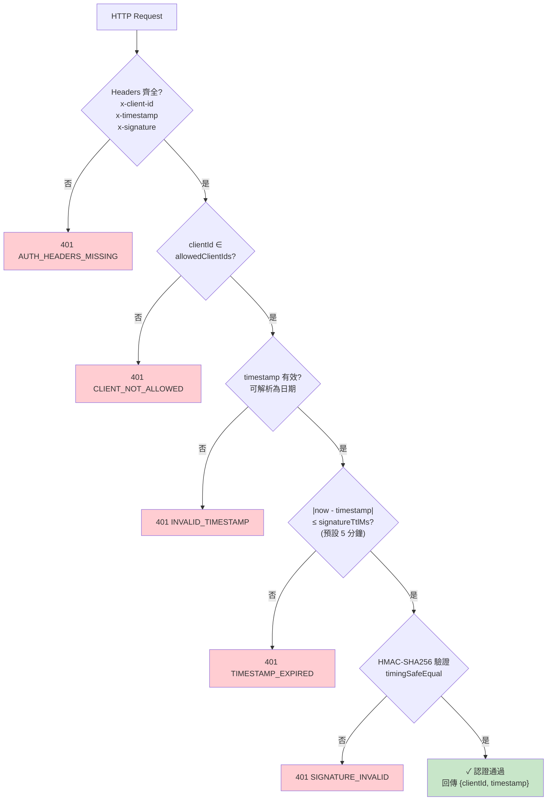

**簽章演算法:**

```
signature = HMAC-SHA256(sharedSecret, "{timestamp}.{rawBody}")
```

---

## 12. 正規化管線

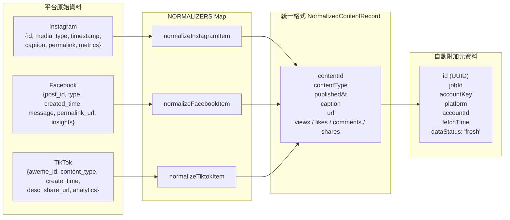

**欄位對應表:**

| 統一欄位 | Instagram | Facebook | TikTok |
|----------|-----------|----------|--------|
| `contentId` | `id` | `post_id` | `aweme_id` |
| `contentType` | `media_type.toLowerCase()` | `type.toLowerCase()` | `content_type.toLowerCase()` |
| `publishedAt` | `timestamp` | `created_time` | `create_time` |
| `caption` | `caption` | `message` | `desc` |
| `url` | `permalink` | `permalink_url` | `share_url` |
| `views` | `metrics.plays` | `insights.video_views` | `analytics.play_count` |
| `likes` | `metrics.likes` | `insights.reactions` | `analytics.digg_count` |
| `comments` | `metrics.comments` | `insights.comments` | `analytics.comment_count` |
| `shares` | `metrics.shares` | `insights.shares` | `analytics.share_count` |

---

## 13. 啟動與關閉流程

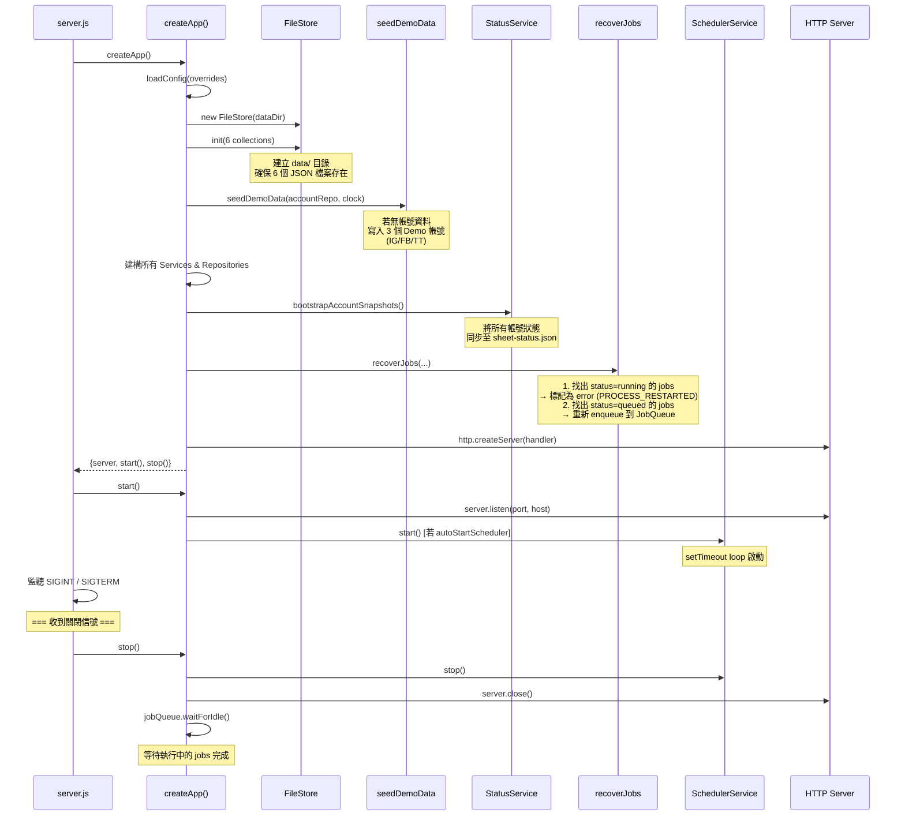

---

## 14. 目錄結構

```
social-media-fetcher-spec-kit/
├── package.json                          # Node.js >= 24, ESM, 零外部依賴
├── src/
│   ├── server.js                         # 程式入口，信號處理
│   ├── app.js                            # 組合根：依賴注入 + HTTP server
│   ├── config.js                         # 環境變數 + 預設值 + 驗證
│   ├── adapters/
│   │   ├── platforms/
│   │   │   ├── platform-registry.js      # 平台適配器註冊表
│   │   │   ├── fixture-platform-adapter.js  # 基於 JSON fixture 的通用適配器
│   │   │   ├── instagram-adapter.js      # IG 時間戳取得器
│   │   │   ├── facebook-adapter.js       # FB 時間戳取得器
│   │   │   └── tiktok-adapter.js         # TT 時間戳取得器
│   │   └── sheets/
│   │       └── file-sheet-gateway.js     # Sheet 寫入閘道 (檔案版)
│   ├── cli/
│   │   ├── seed-demo.js                  # 植入 Demo 帳號資料
│   │   └── sign-request.js              # 產生 HMAC 簽章
│   ├── lib/
│   │   ├── errors.js                     # HttpError + toErrorResponse
│   │   ├── fs-store.js                   # JSON 檔案儲存 (原子寫入 + 鎖)
│   │   ├── http.js                       # readJsonRequest + sendJson
│   │   └── logger.js                     # 結構化 JSON logger
│   ├── repositories/
│   │   ├── account-config-repository.js  # 帳號設定 CRUD
│   │   ├── job-repository.js             # Job CRUD + 查詢
│   │   ├── raw-record-repository.js      # 原始紀錄 (append-only)
│   │   ├── normalized-record-repository.js  # 正規化紀錄 (replace per account)
│   │   └── sheet-snapshot-repository.js  # Sheet 快照 (status + output)
│   ├── routes/
│   │   ├── health-route.js               # GET /health
│   │   ├── manual-refresh-route.js       # POST /api/v1/refresh-jobs/manual
│   │   └── internal-scheduled-sync-route.js  # POST /api/v1/internal/scheduled-sync
│   └── services/
│       ├── auth-service.js               # HMAC 簽章 + 驗證
│       ├── job-factory.js                # Job 物件工廠
│       ├── job-queue.js                  # 並行佇列 (bounded concurrency)
│       ├── manual-refresh-service.js     # 手動刷新業務邏輯
│       ├── normalization-service.js      # 多平台正規化
│       ├── refresh-orchestrator.js       # Job 執行編排器
│       ├── scheduled-sync-service.js     # 排程同步業務邏輯
│       ├── scheduler-service.js          # 定時器 (setTimeout loop)
│       ├── status-service.js             # 帳號狀態 + Sheet 同步
│       └── validation-service.js         # 請求參數驗證
├── data/                                 # 執行時 JSON 資料 (gitignored)
├── fixtures/platforms/                   # 模擬平台 API 回應
│   ├── instagram--acct-instagram-demo.json
│   ├── facebook--acct-facebook-demo.json
│   └── tiktok--acct-tiktok-demo.json
├── tests/
│   ├── unit/                             # 單元測試 (8 檔)
│   └── integration/                      # 整合測試 (4 檔)
└── specs/001-social-data-hub/            # 規格文件
    ├── spec.md                           # 功能需求規格
    ├── data-model.md                     # 資料模型定義
    ├── plan.md                           # 實作計畫
    ├── tasks.md                          # 任務追蹤
    ├── quickstart.md                     # 快速開始指南
    ├── research.md                       # 技術研究
    └── contracts/api.openapi.yaml        # OpenAPI 規格
```

---

## 15. 組態參數

| 參數 | 環境變數 | 預設值 | 說明 |
|------|---------|--------|------|
| `host` | `HOST` | `127.0.0.1` | 監聽位址 |
| `port` | `PORT` | `3000` | 監聽埠號 |
| `dataDir` | `DATA_DIR` | `./data` | JSON 資料目錄 |
| `fixturesDir` | `FIXTURES_DIR` | `./fixtures/platforms` | Fixture 檔案目錄 |
| `sharedSecret` | `API_SHARED_SECRET` | **必填** (無預設) | HMAC 共享密鑰 |
| `allowedClientIds` | `ALLOWED_CLIENT_IDS` | `["demo-sheet"]` | 允許的 client ID 列表 |
| `signatureTtlMs` | `SIGNATURE_TTL_MS` | `300,000` (5min) | 簽章有效期 |
| `maxRequestBodyBytes` | `MAX_REQUEST_BODY_BYTES` | `1,048,576` (1MB) | 請求 body 大小上限 |
| `maxConcurrentJobs` | `MAX_CONCURRENT_JOBS` | `3` | 最大同時執行 job 數 |
| `sourceRateLimitWindowMs` | `SOURCE_RATE_LIMIT_WINDOW_MS` | `60,000` (1min) | 來源頻率限制窗口 |
| `sourceRateLimitMax` | `SOURCE_RATE_LIMIT_MAX` | `10` | 窗口內最大請求數 |
| `accountCooldownMs` | `ACCOUNT_COOLDOWN_MS` | `30,000` (30s) | 帳號冷卻期 |
| `scheduleIntervalMs` | `SCHEDULE_INTERVAL_MS` | `300,000` (5min) | 排程觸發間隔 |

---

## 16. API 端點摘要

| Method | Path | 認證 | 說明 |
|--------|------|------|------|
| `GET` | `/health` | 無 | 健康檢查，回傳 queue/scheduler 狀態 |
| `GET` | `/api/v1/ui/accounts` | Session | 帳號列表（Dashboard 用） |
| `GET` | `/api/v1/ui/accounts/:platform/:accountId` | Session | 帳號詳情（Dashboard 用） |
| `POST` | `/api/v1/auth/register` | 無 | 用戶註冊 |
| `POST` | `/api/v1/auth/login` | 無 | 用戶登入 |
| `POST` | `/api/v1/auth/logout` | Session | 用戶登出 |
| `GET` | `/api/v1/auth/me` | Session | 取得當前用戶 |
| `POST` | `/api/v1/auth/forgot-password` | 無 | 忘記密碼 |
| `POST` | `/api/v1/auth/reset-password` | Token | 重設密碼 |
| `GET` | `/api/v1/admin/pending-users` | Session + Admin | 列出待審核用戶 |
| `POST` | `/api/v1/admin/pending-users/:userId/approve` | Session + Admin | 核准用戶 |
| `POST` | `/api/v1/admin/pending-users/:userId/reject` | Session + Admin | 拒絕用戶 |
| `POST` | `/api/v1/refresh-jobs/manual` | HMAC | 觸發單一帳號手動刷新 |
| `POST` | `/api/v1/internal/scheduled-sync` | HMAC | 觸發所有 active 帳號排程同步 |

---

## 17. 保護機制

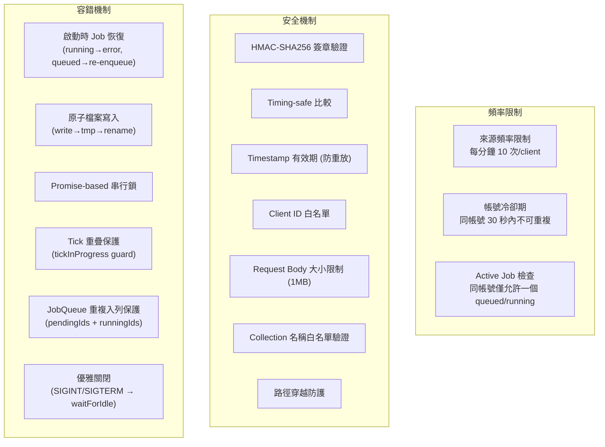

---

## 18. 測試覆蓋

| 類型 | 檔案 | 測試對象 |
|------|------|----------|
| Unit | `auth-service.test.js` | HMAC 簽章 + 驗證流程 |
| Unit | `config.test.js` | 組態載入 + 驗證 |
| Unit | `file-sheet-gateway.test.js` | Sheet 閘道寫入 |
| Unit | `fs-store.test.js` | FileStore 讀寫 + 原子性 + 安全性 |
| Unit | `job-queue.test.js` | 佇列並行 + 重複保護 |
| Unit | `logger.test.js` | 結構化日誌 + 循環引用 |
| Unit | `normalization-service.test.js` | 三平台正規化 |
| Unit | `scheduler-service.test.js` | 定時器 + tick 重疊保護 |
| Integration | `http-safety.test.js` | HTTP 安全性 (body 大小等) |
| Integration | `manual-refresh.test.js` | 手動刷新端對端流程 |
| Integration | `protections.test.js` | 頻率限制 + 冷卻期 |
| Integration | `scheduled-sync.test.js` | 排程同步端對端流程 |

---

## 19. 設計特點與取捨

### 優點

1. **零外部依賴** — 完全使用 Node.js 標準函式庫，無 npm install 需求
2. **乾淨的分層架構** — Routes → Services → Repositories → FileStore，單向依賴
3. **依賴注入** — 透過 `app.js` 組合根集中管理，便於測試替換
4. **原子寫入** — FileStore 使用 tmp + rename 策略，避免部分寫入
5. **多層保護** — 頻率限制、冷卻期、重複 job 檢查、HMAC 認證
6. **啟動恢復** — 行程重啟後自動恢復 queued jobs、標記 running jobs 為錯誤
7. **Platform Adapter 模式** — 可輕鬆擴充新平台支援

### 取捨

1. **JSON 檔案儲存** — 適合小規模 Demo，不適合生產高併發場景
2. **Fixture 取代真實 API** — 目前平台適配器讀取本地 JSON，未實作真正的 API 呼叫
3. **File-based Sheet Gateway** — 模擬 Google Sheets API，寫入本地 JSON
4. **記憶體內頻率限制** — 行程重啟後計數器歸零
5. **無持久化的排程器** — `SchedulerService` 基於 `setTimeout`，重啟後重新開始計時
