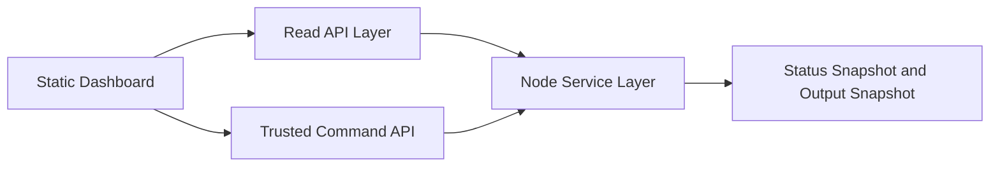

# 前端需求與整合設計

## 分析依據

本文件依據以下規格與實作整理：

- [`specs/001-social-data-hub/spec.md`](../specs/001-social-data-hub/spec.md)
- [`specs/001-social-data-hub/plan.md`](../specs/001-social-data-hub/plan.md)
- [`specs/001-social-data-hub/quickstart.md`](../specs/001-social-data-hub/quickstart.md)
- [`specs/001-social-data-hub/contracts/api.openapi.yaml`](../specs/001-social-data-hub/contracts/api.openapi.yaml)
- [`package.json`](../package.json)
- [`src/server.js`](../src/server.js)
- [`src/app.js`](../src/app.js)
- [`src/routes/manual-refresh-route.js`](../src/routes/manual-refresh-route.js)
- [`src/routes/internal-scheduled-sync-route.js`](../src/routes/internal-scheduled-sync-route.js)
- [`src/routes/health-route.js`](../src/routes/health-route.js)
- [`src/services/status-service.js`](../src/services/status-service.js)

另為釐清前端可用資料來源與實際限制，補充參考：

- [`specs/001-social-data-hub/data-model.md`](../specs/001-social-data-hub/data-model.md)
- [`src/services/manual-refresh-service.js`](../src/services/manual-refresh-service.js)
- [`src/services/scheduled-sync-service.js`](../src/services/scheduled-sync-service.js)
- [`src/services/auth-service.js`](../src/services/auth-service.js)
- [`src/adapters/sheets/file-sheet-gateway.js`](../src/adapters/sheets/file-sheet-gateway.js)
- [`src/repositories/sheet-snapshot-repository.js`](../src/repositories/sheet-snapshot-repository.js)

## 1. 目前產品與前端邊界

- 操作與展示前端為 React Dashboard（內部操作台），Google Sheet 為客戶報表展示端（由 Server 直接回寫）。
- Server 是唯一可信核心。
- 現有 Node 服務公開多個 HTTP 路由，包含：
  - 健康檢查 [`GET /health`]
  - 帳號列表 [`GET /api/v1/ui/accounts`]
  - 帳號詳情 [`GET /api/v1/ui/accounts/:platform/:accountId`]
  - 手動刷新 [`POST /api/v1/refresh-jobs/manual`]（HMAC 認證）
  - 排程同步 [`POST /api/v1/internal/scheduled-sync`]（HMAC 認證）
  - 用戶認證（register / login / logout / me / forgot-password / reset-password）
  - 管理員功能（pending-users / approve / reject）
- 現有後端已經保存前端最需要的兩類資料：
  - 帳號狀態快照，由 `StatusService` 寫入 `sheet-status`
  - 整理後內容輸出，由 `FileSheetGateway` 寫入 `sheet-output`
- Dashboard 透過 Session Cookie 認證存取 API，手動刷新功能透過後端代理呼叫。

## 2. 最小可行前端形態

### 建議結論

最小可行版本建議做成 **單頁靜態 Dashboard**，而不是先做多頁 SPA。

理由：

- 目前專案沒有前端框架、打包器或 UI library。
- [`package.json`](../package.json) 顯示 runtime 僅使用 Node.js 標準函式庫，代表前端也應維持低複雜度。
- 現有後端最接近前端需求的是狀態檢視、單帳號刷新、同步結果表格，單頁即可覆蓋。

### 建議頁面與區塊

最少只需要 **1 個頁面、4 個核心區塊、1 個可選管理區塊**。

#### 頁面 A：營運 Dashboard

1. **服務狀態區塊**
2. **帳號列表區塊**
3. **帳號詳情與手動刷新區塊**
4. **內容結果表格區塊**
5. **可選：管理員排程同步區塊**

## 3. 各區塊需要顯示的欄位與後端銜接

| 區塊 | 主要欄位 | 目前可對應後端 | API 現況 | 備註 |
|---|---|---|---|---|
| 服務狀態 | `status`、`queue.pending`、`queue.running`、`queue.concurrency`、`scheduler.running`、`scheduler.intervalMs`、`scheduler.tickInProgress`、`now` | [`handleHealthRoute()`](../src/routes/health-route.js#L3) | 已存在 | 可直接重用 [`GET /health`](../specs/001-social-data-hub/contracts/api.openapi.yaml) |
| 帳號列表 | `clientName`、`platform`、`accountId`、`refreshDays`、`isActive`、`refreshStatus`、`systemMessage`、`lastRequestTime`、`lastSuccessTime`、`currentJobId` | [`AccountConfiguration`](../specs/001-social-data-hub/data-model.md) + [`SheetStatusSnapshot`](../specs/001-social-data-hub/data-model.md) | 缺少讀取 API | 需由帳號設定與狀態快照組合成前端列表資料 |
| 帳號詳情與手動刷新 | 選定帳號的基本資料、目前狀態、最近成功時間、目前工作 ID、可提交的 `refresh_days` | [`handleManualRefreshRoute()`](../src/routes/manual-refresh-route.js#L5) + [`ManualRefreshService`](../src/services/manual-refresh-service.js) | 送出 API 已存在，讀取詳情不足 | 手動刷新可沿用現有 POST，但瀏覽器不能直接持有 HMAC secret |
| 內容結果表格 | `syncedAt`、`content_id`、`content_type`、`published_at`、`caption`、`url`、`views`、`likes`、`comments`、`shares`、`data_status` | [`writeOutput()`](../src/adapters/sheets/file-sheet-gateway.js#L19) 寫入的 output snapshot | 缺少讀取 API | 這是前端最主要的內容展示區 |
| 管理員排程同步 | `requested_by`、接受的 jobs 數量、`skipped_accounts`、略過原因 | [`handleInternalScheduledSyncRoute()`](../src/routes/internal-scheduled-sync-route.js#L6) + [`ScheduledSyncService`](../src/services/scheduled-sync-service.js) | 已有 POST，缺少 browser-safe 入口 | 建議標示為管理員功能，而非一般操作入口 |

### 3.1 服務狀態區塊

**建議顯示欄位**

- 服務健康狀態
- 目前 queue 等候數
- 目前 queue 執行中數量
- queue 並行上限
- scheduler 是否啟動
- scheduler 週期
- scheduler 是否正在執行中
- 伺服器時間

**可直接對應 API**

- 現有 [`/health`](../specs/001-social-data-hub/contracts/api.openapi.yaml)

**前端用途**

- 讓營運人員快速判斷系統是否存活
- 讓管理員理解目前工作堆積與排程狀態

### 3.2 帳號列表區塊

**建議顯示欄位**

- 客戶名稱 `clientName`
- 平台 `platform`
- 帳號 `accountId`
- 預設刷新天數 `refreshDays`
- 是否啟用 `isActive`
- 目前狀態 `refreshStatus`
- 系統訊息 `systemMessage`
- 最近請求時間 `lastRequestTime`
- 最近成功時間 `lastSuccessTime`
- 目前工作 ID `currentJobId`

**後端資料來源**

- [`AccountConfiguration`](../specs/001-social-data-hub/data-model.md)
- [`SheetStatusSnapshot`](../specs/001-social-data-hub/data-model.md)
- [`StatusService`](../src/services/status-service.js) 已保證帳號狀態會同步寫回 snapshot

**所需銜接方式**

目前沒有現成讀取 API，建議新增一個聚合讀取端點，概念如下：

- `GET /api/v1/ui/accounts`

此端點應回傳：

- 帳號設定基本欄位
- 最新狀態快照欄位
- 供列表排序與篩選的衍生欄位

### 3.3 帳號詳情與手動刷新區塊

**建議顯示欄位**

- `clientName`
- `platform`
- `accountId`
- `refreshStatus`
- `systemMessage`
- `lastRequestTime`
- `lastSuccessTime`
- `currentJobId`
- 預設 `refreshDays`
- 可提交的手動刷新值 `refresh_days`

**操作**

- 點選帳號後顯示詳情
- 提供手動刷新按鈕
- 提交成功後立即顯示 `queued`
- 後續透過輪詢刷新帳號狀態與內容結果

**可對應既有 API**

- 現有 [`/api/v1/refresh-jobs/manual`](../specs/001-social-data-hub/contracts/api.openapi.yaml)

**重要限制**

- 此 API 需要 `x-client-id`、`x-timestamp`、`x-signature`
- 簽章由 [`verifySignedRequest()`](../src/services/auth-service.js#L23) 驗證
- 瀏覽器端不應持有 `API_SHARED_SECRET`

**因此建議**

- 不要讓瀏覽器直接呼叫現有 HMAC API
- 應透過受信任的後端包裝層代送，或新增 browser-safe command route，再於 server 內部重用 [`ManualRefreshService`](../src/services/manual-refresh-service.js)

### 3.4 內容結果表格區塊

**建議顯示欄位**

- 同步時間 `syncedAt`
- 內容 ID `content_id`
- 內容類型 `content_type`
- 發布時間 `published_at`
- 摘要 `caption`
- 連結 `url`
- 觀看數 `views`
- 按讚數 `likes`
- 留言數 `comments`
- 分享數 `shares`
- 資料狀態 `data_status`

**後端資料來源**

- [`writeOutput()`](../src/adapters/sheets/file-sheet-gateway.js#L19) 已將 normalized records 轉成前端可讀欄位
- 寫入位置來自 [`SheetSnapshotRepository`](../src/repositories/sheet-snapshot-repository.js)

**所需銜接方式**

目前沒有讀取 API，建議至少新增：

- `GET /api/v1/ui/accounts/:platform/:accountId/output`

若希望減少 API 數量，也可將列表與詳情合併為：

- `GET /api/v1/ui/accounts`
- `GET /api/v1/ui/accounts/:platform/:accountId`

其中詳情端點直接包含最新 output snapshot。

### 3.5 可選管理員排程同步區塊

**建議顯示欄位**

- 觸發人 `requested_by`
- 本次 accepted jobs 數量
- `accepted_jobs`
- `skipped_accounts`
- 每個 skipped account 的原因

**可對應既有 API**

- 現有 [`/api/v1/internal/scheduled-sync`](../specs/001-social-data-hub/contracts/api.openapi.yaml)

**建議定位**

- 僅供管理員或維運使用
- 不建議放在一般營運人員的主操作流程第一層

## 4. 建議的靜態前端實作方式

### 4.1 技術選型

在目前專案限制下，建議採用：

- 純靜態 HTML
- 原生 CSS
- 原生 ES Modules JavaScript
- 使用 `fetch` 呼叫後端
- 不引入前端框架
- 不引入打包器

### 4.2 建議目錄與實作形式

建議未來前端資產放在：

- [`frontend/`](../frontend/)

最小結構可為：

- [`frontend/index.html`](../frontend/index.html)
- [`frontend/main.js`](../frontend/main.js)
- [`frontend/styles.css`](../frontend/styles.css)

### 4.3 前端互動模式

- 進站先載入服務狀態與帳號列表
- 使用列表點選切換帳號詳情
- 手動刷新送出後，前端不等待完成，只更新畫面為已送出
- 之後以輪詢方式更新帳號狀態與內容快照

### 4.4 為何不建議更重的方案

- 目前後端是單體 Node 服務，沒有現成靜態資產 pipeline
- 專案刻意維持無外部 runtime dependency
- 需求以內部資料檢視與操作為主，尚未需要 SPA 複雜路由或高度互動元件

## 5. API 整合建議

### 可直接沿用的既有 API

1. **健康狀態**
   - [`GET /health`](../specs/001-social-data-hub/contracts/api.openapi.yaml)

2. **單帳號手動刷新**
   - [`POST /api/v1/refresh-jobs/manual`](../specs/001-social-data-hub/contracts/api.openapi.yaml)
   - 只能經由受信任中介層使用，不建議瀏覽器直接打

3. **排程同步觸發**
   - [`POST /api/v1/internal/scheduled-sync`](../specs/001-social-data-hub/contracts/api.openapi.yaml)
   - 建議僅作管理員功能

### 必要新增的前端讀取能力

若要讓 web 前端可用，至少需要補以下其中一種方案：

#### 方案 A：新增前端專用讀取 API

- `GET /api/v1/ui/accounts`
- `GET /api/v1/ui/accounts/:platform/:accountId`
- `GET /api/v1/ui/accounts/:platform/:accountId/output`

#### 方案 B：新增單一聚合 Dashboard API

- `GET /api/v1/ui/dashboard`

由單一端點一次回傳：

- health summary
- account list
- selected account latest output

### 建議優先順序

最務實的是先做：

1. `GET /health` 直接重用
2. 新增帳號列表聚合 API
3. 新增單帳號 output API
4. 以受信任代理包裝手動刷新 POST

## 6. 已知缺口與風險

1. **瀏覽器無法安全直連現有寫入 API**
   - 現有寫入端點都依賴 HMAC
   - [`verifySignedRequest()`](../src/services/auth-service.js#L23) 的 shared secret 不可暴露到前端

2. **目前沒有前端可用的讀取 API**
   - 雖然資料已存在 [`sheet-status`](../data/) 與 [`sheet-output`](../data/)
   - 但目前沒有安全且穩定的 HTTP 讀取介面

3. **目前 server 不負責靜態檔案服務**
   - [`createApp()`](../src/app.js#L66) 只註冊 API 路由，沒有 static file handling

4. **目前沒有 job 詳情查詢端點**
   - 手動刷新接受後，只能靠帳號狀態快照間接觀察進度
   - 若前端要顯示更完整的 job lifecycle，需補 job query API

5. **系統仍以 React Dashboard 為主要操作介面，Google Sheet 為客戶報表展示端**
   - React Dashboard 是操作與展示入口
   - Google Sheet 由 Server 透過 Google Sheets API 直接回寫資料，供客戶查看
   - 不使用 Apps Script

6. **目前佇列與部分限流狀態為 in-memory**
   - [`JobQueue`](../src/services/job-queue.js) 與 [`ManualRefreshService`](../src/services/manual-refresh-service.js) 的部分執行中狀態依賴單機記憶體
   - 這與目前單一 service instance 的規劃一致，但前端設計不應預設多節點一致性

## 7. 建議的最小交付範圍

若後續要實作 web 前端，建議最小交付範圍如下：

1. 一個單頁 Dashboard
2. 可顯示服務健康狀態
3. 可顯示帳號列表與目前刷新狀態
4. 可查看單帳號最新 normalized output
5. 可從受信任入口送出單帳號手動刷新

在這個範圍內，就能滿足目前規格最接近前端需求的觀察、查詢、刷新三件事，同時不違反 Server 為唯一可信核心的設計原則。
