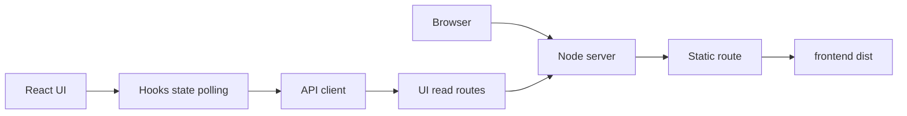
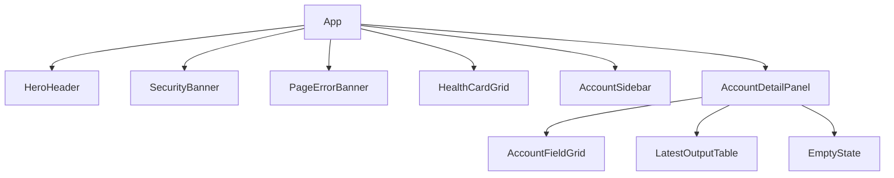

# React + Vite 前端改造方案

## 1. 分析範圍與現況摘要

本方案依據以下檔案分析，並聚焦在將現有唯讀靜態儀表板重構為 React + Vite，而不改變既有安全邊界：

- [`package.json`](../package.json)
- [`frontend/index.html`](../frontend/index.html)
- [`frontend/main.js`](../frontend/main.js)
- [`frontend/styles.css`](../frontend/styles.css)
- [`src/app.js`](../src/app.js)
- [`src/routes/static-frontend-route.js`](../src/routes/static-frontend-route.js)
- [`src/routes/ui-accounts-route.js`](../src/routes/ui-accounts-route.js)
- [`docs/frontend-plan.md`](./frontend-plan.md)
- [`specs/001-social-data-hub/quickstart.md`](../specs/001-social-data-hub/quickstart.md)

補充交叉比對的實作依據：

- [`UiDashboardService`](../src/services/ui-dashboard-service.js#L75)
- [`tests/integration/frontend-ui.test.js`](../tests/integration/frontend-ui.test.js)

### 1.1 目前前端與伺服器的關鍵現況

1. [`frontend/index.html`](../frontend/index.html) 目前是單頁唯讀儀表板 HTML，頁面區塊已固定成 hero、security banner、health cards、account list、account detail 與 output table。
2. [`refreshDashboard()`](../frontend/main.js#L48) 會並行讀取 [`GET /health`](../src/app.js#L186) 與 [`GET /api/v1/ui/accounts`](../src/app.js#L191)，並以 15 秒輪詢更新畫面。
3. [`loadSelectedAccount()`](../frontend/main.js#L86) 會依選取帳號讀取 [`GET /api/v1/ui/accounts/:platform/:accountId`](../src/app.js#L196)。
4. [`frontend/styles.css`](../frontend/styles.css) 已含完整的 design token、layout、表格、狀態 badge 與 empty state 樣式，可直接作為 React 版樣式遷移基礎。
5. [`handleStaticFrontendRoute()`](../src/routes/static-frontend-route.js#L20) 目前只硬編碼提供 `/`、`/index.html`、`/main.js`、`/styles.css`，不支援 Vite 產生的 hashed assets。
6. [`createApp()`](../src/app.js#L174) 會先嘗試靜態檔案路由，再處理 `/health` 與 UI read APIs，代表 React build 只要能被相同 static route 提供，就能繼續沿用現有 Node server。
7. [`handleUiAccountsRoute()`](../src/routes/ui-accounts-route.js#L4) 與 [`handleUiAccountDetailRoute()`](../src/routes/ui-accounts-route.js#L14) 已提供 React 首版所需的唯讀資料，不需要為這次改造新增資料聚合 API。
8. [`UI_CAPABILITIES`](../src/services/ui-dashboard-service.js#L4) 明確宣告目前前端為 read-only，且 `manualRefresh`、`scheduledSync` 都是 `false`，這是本次重構必須維持的核心限制。

### 1.2 本次改造的邊界

- 目標是把現有靜態頁面改造成 React + Vite 單頁應用，但仍維持單頁儀表板模型。
- 不在此次改造中加入 React Router、多頁導覽或 client-side write command。
- 不讓前端直接呼叫受 HMAC 保護的寫入 API，如 [`POST /api/v1/refresh-jobs/manual`](../src/app.js#L212) 與 [`POST /api/v1/internal/scheduled-sync`](../src/app.js#L217)。
- 不讓前端保存第三方平台 access token、refresh token、或 `API_SHARED_SECRET`，此限制也與 [`specs/001-social-data-hub/quickstart.md`](../specs/001-social-data-hub/quickstart.md) 及 [`docs/frontend-plan.md`](./frontend-plan.md) 一致。

## 2. 建議的目標架構

### 2.1 技術決策

- 前端框架：React
- 打包工具：Vite
- 路由：首版不引入 React Router，維持單頁 Dashboard
- 狀態管理：使用 React built-in state 與 custom hooks，不引入額外全域 state library
- 樣式：保留全域 design tokens，搭配 component-level CSS Modules
- API 存取：使用自製 lightweight API client，直接存取既有 read-only endpoints

### 2.2 為何採單頁 React，而不是擴大成多頁 SPA

現有 HTML 與 [`frontend/main.js`](../frontend/main.js) 的功能邊界非常集中：

- 首頁即儀表板
- 無導覽列與多頁切換
- 互動主要是重新整理、帳號選取、輪詢同步

因此建議先做「單頁 React 化」，而不是一開始導入多頁 SPA 或複雜路由，這樣可以在最小變動下取得：

- 更好維護的元件切分
- 更清楚的資料流
- 更可測試的 hooks 與 API client
- 與現有 Node server 最低摩擦的整合方式

### 2.3 目標資料流



## 3. 建議的目錄結構與主要檔案

建議將 [`frontend/`](../frontend/) 轉成 Vite app root，並讓 build 輸出到 [`frontend/dist/`](../frontend/) 之下。

```text
frontend/
  index.html
  src/
    main.jsx
    App.jsx
    api/
      httpClient.js
      dashboardApi.js
    components/
      layout/
        AppShell.jsx
        HeroHeader.jsx
      dashboard/
        SecurityBanner.jsx
        PageErrorBanner.jsx
        HealthCardGrid.jsx
        AccountSidebar.jsx
        AccountListItem.jsx
        AccountDetailPanel.jsx
        AccountFieldGrid.jsx
        LatestOutputTable.jsx
        EmptyState.jsx
    hooks/
      useDashboardData.js
      useSelectedAccount.js
      useAutoRefresh.js
    styles/
      tokens.css
      globals.css
    utils/
      formatters.js
  dist/
vite.config.js
```

### 3.1 主要檔案責任

- [`frontend/index.html`](../frontend/index.html)
  - 改為 Vite entry HTML
  - 主體只保留 `root` 掛載點與必要 meta
- [`frontend/src/main.jsx`](../frontend/)
  - 掛載 React root
  - 匯入 [`globals.css`](../frontend/) 與 [`tokens.css`](../frontend/)
- [`frontend/src/App.jsx`](../frontend/)
  - 組合整個 Dashboard 版面
- [`frontend/src/api/dashboardApi.js`](../frontend/)
  - 封裝 [`GET /health`](../src/app.js#L186)、[`GET /api/v1/ui/accounts`](../src/app.js#L191)、[`GET /api/v1/ui/accounts/:platform/:accountId`](../src/app.js#L196)
- [`frontend/src/hooks/useDashboardData.js`](../frontend/)
  - 管理首頁載入、重新整理、錯誤狀態與帳號列表資料
- [`frontend/src/hooks/useSelectedAccount.js`](../frontend/)
  - 管理目前選取帳號與 detail 資料
- [`frontend/src/hooks/useAutoRefresh.js`](../frontend/)
  - 封裝 15 秒輪詢邏輯，取代 [`window.setInterval()`](../frontend/main.js#L43)
- [`frontend/src/utils/formatters.js`](../frontend/)
  - 遷移 [`formatTimestamp()`](../frontend/main.js#L368)、[`formatDuration()`](../frontend/main.js#L389)、[`formatServiceStatus()`](../frontend/main.js#L407)
- [`vite.config.js`](../vite.config.js)
  - 設定 root、build outDir、dev proxy 與 base path

## 4. 現有靜態頁面功能對應到 React 元件與 hooks

### 4.1 對應表

| 目前靜態實作 | 現有責任 | React 重構對應 |
|---|---|---|
| [`frontend/index.html`](../frontend/index.html) 的整體結構 | 定義所有 panel 與掛載 DOM | [`App`](../frontend/) + [`AppShell`](../frontend/) + 子元件樹 |
| [`refreshDashboard()`](../frontend/main.js#L48) | 載入 health 與 accounts、刷新畫面 | [`useDashboardData`](../frontend/) |
| [`loadSelectedAccount()`](../frontend/main.js#L86) | 讀取選取帳號詳情 | [`useSelectedAccount`](../frontend/) |
| [`renderHealth()`](../frontend/main.js#L100) | 渲染 health cards | [`HealthCardGrid`](../frontend/) |
| [`renderSecurityBanner()`](../frontend/main.js#L161) | 顯示只讀能力說明 | [`SecurityBanner`](../frontend/) |
| [`renderAccountList()`](../frontend/main.js#L166) | 左側帳號列表與統計 | [`AccountSidebar`](../frontend/) + [`AccountListItem`](../frontend/) |
| [`renderAccountDetail()`](../frontend/main.js#L232) | 詳情欄位區與標題 | [`AccountDetailPanel`](../frontend/) + [`AccountFieldGrid`](../frontend/) |
| [`renderOutputTable()`](../frontend/main.js#L272) | 最新同步結果表格 | [`LatestOutputTable`](../frontend/) |
| [`renderEmptyDetail()`](../frontend/main.js#L319) | 無帳號與空狀態 | [`EmptyState`](../frontend/) |
| [`renderPageError()`](../frontend/main.js#L338) | 頁面層級錯誤訊息 | [`PageErrorBanner`](../frontend/) |
| [`toggleLoading()`](../frontend/main.js#L329) | 控制重新整理按鈕 loading | [`HeroHeader`](../frontend/) 接收 `isRefreshing` 與 `onRefresh` props |
| [`fetchJson()`](../frontend/main.js#L348) | 共用 fetch JSON 與錯誤處理 | [`httpClient`](../frontend/) |

### 4.2 建議元件層級



### 4.3 Hooks 設計

#### [`useDashboardData`](../frontend/)

責任：

- 首次載入 health 與 account list
- 提供手動重新整理能力
- 管理 `isLoading`、`error`、`lastUpdated`
- 保存 `capabilities` 與 account summary 所需資料

建議狀態：

- `health`
- `accounts`
- `capabilities`
- `isLoading`
- `error`
- `lastUpdated`

#### [`useSelectedAccount`](../frontend/)

責任：

- 保存 `selectedAccountKey`
- 當 account list 更新時，自動 fallback 到第一筆可用帳號
- 載入 detail payload 與 latest output rows
- 分離 sidebar list 與 detail loading，避免整頁一起重載

建議狀態：

- `selectedAccountKey`
- `selectedAccount`
- `isDetailLoading`
- `detailError`

#### [`useAutoRefresh`](../frontend/)

責任：

- 包裝輪詢邏輯
- 預設沿用 [`POLL_INTERVAL_MS`](../frontend/main.js#L1) 的 15 秒設定
- 在元件 unmount 時正確清除 timer

## 5. 樣式策略

### 5.1 遷移原則

[`frontend/styles.css`](../frontend/styles.css) 已具備完整的視覺 token 與成熟 layout，因此不建議大改視覺設計；建議採以下拆分：

1. 將 `:root` 變數、reset 與 element base style 移到 [`tokens.css`](../frontend/) 與 [`globals.css`](../frontend/)
2. 將元件樣式轉成對應 `*.module.css`
3. 只保留極少數全域 utility class，例如 `muted`

### 5.2 建議保留的樣式語意

以下視覺語意應保留，以降低回歸風險：

- health card tone
- account selected state
- status pill 顏色對應
- output table sticky header
- empty state 與 error banner 視覺層級

### 5.3 樣式實務建議

- 不引入 CSS-in-JS
- 不引入 UI framework
- 優先使用 Vite 內建支援的 CSS Modules
- 命名對應舊 class semantics，便於 code review 與比對舊畫面

## 6. API client 設計

### 6.1 可直接沿用的 API

React 首版只需要三個既有 read endpoints：

- [`GET /health`](../src/app.js#L186)
- [`GET /api/v1/ui/accounts`](../src/app.js#L191)
- [`GET /api/v1/ui/accounts/:platform/:accountId`](../src/app.js#L196)

這三個端點已足夠支撐現有頁面功能，因為 [`UiDashboardService`](../src/services/ui-dashboard-service.js#L82) 已提供 accounts list，[`UiDashboardService.getAccountDetail()`](../src/services/ui-dashboard-service.js#L96) 已提供 detail 與 rows。

### 6.2 建議 API client 介面

[`dashboardApi`](../frontend/) 建議提供：

- `getHealth()`
- `listAccounts()`
- `getAccountDetail platform accountId`

[`httpClient`](../frontend/) 建議責任：

- 統一送出 `accept: application/json`
- 統一 parse JSON
- 將非 2xx 回應轉成可讀錯誤
- 支援 `AbortController`，避免輪詢與切換帳號時競態覆寫畫面

### 6.3 關於寫入 API 的明確限制

本次 React + Vite 改造不得新增任何會直接從瀏覽器呼叫以下端點的功能：

- [`POST /api/v1/refresh-jobs/manual`](../src/app.js#L212)
- [`POST /api/v1/internal/scheduled-sync`](../src/app.js#L217)

原因：

- [`UI_CAPABILITIES`](../src/services/ui-dashboard-service.js#L4) 明確宣告目前為唯讀
- [`tests/integration/frontend-ui.test.js`](../tests/integration/frontend-ui.test.js) 已把「前端不得繞過既有保護」當成回歸測試的一部分
- [`specs/001-social-data-hub/quickstart.md`](../specs/001-social-data-hub/quickstart.md) 已說明這些寫入端點需要 HMAC headers，不應暴露到瀏覽器

## 7. Vite build 輸出與現有 Node server 的整合方式

### 7.1 建議 build 輸出策略

- Vite app root：[`frontend/`](../frontend/)
- build output：[`frontend/dist/`](../frontend/)
- public base：`/`

理由：

- 可沿用目前以 repo root 為主的 [`package.json`](../package.json)
- 不需要額外建立第二個 package workspace
- 與目前 [`src/routes/static-frontend-route.js`](../src/routes/static-frontend-route.js) 的責任最接近

### 7.2 伺服器整合建議

[`handleStaticFrontendRoute()`](../src/routes/static-frontend-route.js#L20) 需從「固定 4 個檔名對照」改為「提供 dist 內的實際 build artifacts」，建議做法如下：

1. 靜態根目錄由 [`frontend/`](../frontend/) 改為 [`frontend/dist/`](../frontend/)
2. `/` 與 `/index.html` 回傳 build 後的 `index.html`
3. `/assets/*` 直接對應 Vite 產生的 hashed JS 與 CSS 檔案
4. 若未來加入 client-side route，對非 `/api`、非 `/health` 的 GET request 可 fallback 回 `index.html`
5. 針對 `index.html` 維持 `cache-control: no-cache`
6. 針對 hashed assets 設定較長效快取與 `immutable`
7. 持續保留 `x-content-type-options: nosniff`
8. 加入路徑正規化與 prefix 檢查，避免 path traversal

### 7.3 開發模式建議

建議開發時採雙程序：

1. Node server 負責 API 與最終 production serving
2. Vite dev server 負責前端 HMR

Vite dev server 建議 proxy：

- `/health` -> Node server
- `/api` -> Node server

如此 React 前端在開發期即可直接對現有 API 工作，而不必在瀏覽器端寫死跨網域位址。

## 8. [`package.json`](../package.json) 需要新增或調整的 script 與 dependency

### 8.1 建議 scripts

| script | 建議內容 | 用途 |
|---|---|---|
| `start` | 維持 `node src/server.js` | production server 啟動 |
| `dev:server` | `node src/server.js` | 本機 API server |
| `dev:frontend` | `vite` | 本機 React + Vite 開發 |
| `build` | `vite build` | 建立 [`frontend/dist/`](../frontend/) |
| `preview:frontend` | `vite preview` | 驗證 build 結果 |
| `test:server` | `node --test` | 既有 backend 與整合測試 |
| `test:ui` | `vitest run` | React 元件與 hooks 測試 |
| `test` | `npm run test:server && npm run test:ui` | 完整測試入口 |

### 8.2 建議 dependencies

| 類型 | 套件 | 說明 |
|---|---|---|
| dependencies | `react` | 前端元件 runtime |
| dependencies | `react-dom` | React DOM renderer |
| devDependencies | `vite` | build tool 與 dev server |
| devDependencies | `@vitejs/plugin-react` | JSX 與 React Fast Refresh |
| devDependencies | `vitest` | 前端單元與元件測試 |
| devDependencies | `jsdom` | React 測試 DOM 環境 |
| devDependencies | `@testing-library/react` | 元件行為測試 |
| devDependencies | `@testing-library/jest-dom` | DOM assertion helpers |

### 8.3 對既有技術方針的影響

目前 [`package.json`](../package.json) 幾乎沒有外部套件。改成 React + Vite 後，將新增瀏覽器端 runtime 與前端 build-time dependencies；但建議維持以下原則：

- Node server runtime 仍不依賴額外 server framework
- 新依賴只侷限於前端 bundle 與測試工具鏈
- 不在 server 啟動時動態編譯前端
- 部署流程必須先執行 `build`，再執行 `start`

## 9. 測試策略

### 9.1 後端整合測試

延續 [`tests/integration/frontend-ui.test.js`](../tests/integration/frontend-ui.test.js) 的精神，並擴充以下驗證：

1. `/` 仍能回傳前端首頁
2. Vite build 產生的 `/assets/*.js` 與 `/assets/*.css` 可被 Node server 正常提供
3. Content-Type 與 cache headers 正確
4. `/health`、`/api/v1/ui/accounts`、`/api/v1/ui/accounts/:platform/:accountId` 仍可正常工作
5. bundle 內容不得含 `API_SHARED_SECRET`
6. bundle 不得直接包含受保護寫入流程的可用客戶端實作

### 9.2 React 元件測試

建議使用 [`vitest`](../package.json) + Testing Library 覆蓋：

- [`HealthCardGrid`](../frontend/) 在正常與錯誤狀態的顯示
- [`AccountSidebar`](../frontend/) 的列表選取與 selected state
- [`AccountDetailPanel`](../frontend/) 在有 detail 與 empty detail 時的輸出
- [`LatestOutputTable`](../frontend/) 在有 rows 與空 rows 時的呈現
- [`PageErrorBanner`](../frontend/) 與 loading UI 行為

### 9.3 Hooks 與 API client 測試

建議覆蓋：

- [`useDashboardData`](../frontend/) 的初始載入、手動刷新、錯誤處理
- [`useSelectedAccount`](../frontend/) 的 fallback 與切換行為
- [`useAutoRefresh`](../frontend/) 的 timer 清理
- [`httpClient`](../frontend/) 在非 2xx 回應時的錯誤包裝

### 9.4 手動驗證

依照 [`specs/001-social-data-hub/quickstart.md`](../specs/001-social-data-hub/quickstart.md) 的啟動流程，補充以下 smoke test：

1. `npm install`
2. `npm run build`
3. `npm start`
4. 開啟 `/`
5. 驗證首頁可載入 health、account list、detail 與 output rows
6. 驗證前端無 manual refresh 與 scheduled sync 可操作入口

## 10. Migration 順序

建議以可回退、低風險順序進行：

1. 新增 [`vite.config.js`](../vite.config.js) 與 React 相關 scripts dependencies
2. 將 [`frontend/index.html`](../frontend/index.html) 改成 Vite entry shell，只保留 `root` 與必要 meta
3. 建立 [`frontend/src/`](../frontend/) 結構與基礎 [`App`](../frontend/)
4. 將 [`frontend/styles.css`](../frontend/styles.css) 的 token 與 base styles 拆到 [`tokens.css`](../frontend/) 與 [`globals.css`](../frontend/)
5. 依照現有畫面順序先做 [`HeroHeader`](../frontend/)、[`SecurityBanner`](../frontend/)、[`HealthCardGrid`](../frontend/)
6. 實作 [`dashboardApi`](../frontend/) 與 [`useDashboardData`](../frontend/)，完成首頁讀取與重新整理
7. 實作 [`AccountSidebar`](../frontend/)、[`useSelectedAccount`](../frontend/) 與 [`AccountDetailPanel`](../frontend/)
8. 實作 [`LatestOutputTable`](../frontend/) 與空狀態元件
9. 更新 [`handleStaticFrontendRoute()`](../src/routes/static-frontend-route.js#L20) 以支援 [`frontend/dist/`](../frontend/) 與 hashed assets
10. 更新整合測試與新增 React 測試
11. 確認 React 版功能與目前靜態版 parity 後，再移除 [`frontend/main.js`](../frontend/main.js) 與舊的單檔 [`frontend/styles.css`](../frontend/styles.css) 直接掛載方式

### 10.1 遷移期間的重要原則

- 先求讀取功能 parity，不擴充新功能
- 不把 manual refresh UI 偷渡進此次重構
- 不在尚未更新 static route 前就假設 production 可讀取 Vite assets
- 每一階段都保持 `/health` 與 UI APIs 可獨立驗證

## 11. 可能風險與對既有安全邊界的影響

### 11.1 技術風險

1. **static route 複雜度上升**
   - 目前 [`STATIC_FILES`](../src/routes/static-frontend-route.js#L7) 是固定映射
   - 改成 Vite 後要處理 hashed assets、content type、cache policy 與 path safety

2. **開發與部署流程增加 build 步驟**
   - 目前 [`package.json`](../package.json#L6) 沒有 build script
   - 改造後若漏掉 `vite build`，[`start`](../package.json#L7) 可能找不到最新前端資產

3. **測試堆疊變多**
   - 現在只有 [`node --test`](../package.json#L10)
   - 導入 React 後需同時維護 server tests 與 UI tests

4. **CSS 遷移可能造成視覺回歸**
   - 現有 [`frontend/styles.css`](../frontend/styles.css) 是單檔全域樣式
   - 拆成元件後若 class 語意未對齊，容易出現排版差異

### 11.2 安全邊界影響

1. **不得改變唯讀定位**
   - 目前 [`UI_CAPABILITIES`](../src/services/ui-dashboard-service.js#L4) 已明確限制 UI 為 read-only
   - React 化後也應保留同樣的提示與限制

2. **不得把簽章能力搬到瀏覽器**
   - 不可將 `API_SHARED_SECRET`、HMAC 邏輯或任何簽章 helper 打包到 client bundle

3. **不得新增前端直連第三方平台 API**
   - 前端仍只能呼叫 Node server 提供的內部 read APIs
   - 所有對 Instagram、Facebook、TikTok 的連線仍必須在 server 端完成

4. **不得讓前端裁決最終寫入結果**
   - React UI 僅作展示與唯讀互動
   - 帳號狀態、輸出快照與最終狀態仍以 server 資料為準

## 12. 最終建議結論

本次改造最務實的路徑是：

1. 以 [`frontend/`](../frontend/) 作為 Vite root
2. 先做單頁 React Dashboard，不引入多頁路由
3. 只消費既有 read-only API，不新增瀏覽器寫入能力
4. 讓 Node server 改為提供 [`frontend/dist/`](../frontend/) 內的 Vite build artifacts
5. 以畫面 parity、靜態資產 serving、與安全邊界不退化作為驗收主軸

若依此方案執行，React + Vite 會帶來更可維護的前端結構，同時仍符合目前專案「Server 為唯一可信核心、前端僅作受限展示」的設計原則。
